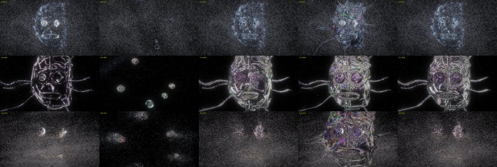

# The Astral Forge: Architecture (approaches A-E, benchmarked)

Brief §15, §16 and §20.2. All five approaches are implemented in **one** prototype executable, so they share
the same conductor, audio, camera, particles, material and post. Only the representation differs.

```
cmake -S . -B build/release -DCMAKE_BUILD_TYPE=Release -DAVGEN_ASTRAL_FORGE_PROTOTYPE=ON
cmake --build build/release -j 10 --target avgen_astral_forge
tools/gpu-lock.sh ./build/release/prototypes/astral-forge/avgen_astral_forge --test 1 --approach E --at 10.8 --png out.png
tools/gpu-lock.sh ./build/release/prototypes/astral-forge/avgen_astral_forge --test 1 --approach E --bench --at 10.8
```

Machine: Apple M2 Max (38-core GPU), Dawn/WebGPU on Metal, 1920×1080 unless stated. Every run used
`tools/gpu-lock.sh`, with one frame in flight (each frame waits on the queue), so pass timestamps are not
overlapped by neighbouring frames. Each figure is the p50 of 240 measured frames after 60 warm-up frames,
following a 6 s simulation pre-roll. Raw data: `bench-approaches.jsonl`.

## The five approaches as built

| | Representation | Particles | Visible surface |
|---|---|---|---|
| **A** | GPU particles + compute splatting | bound to the latent anatomy | none: the flakes alone |
| **B** | GPU particles → density field | **no latent**: wandering point attractors | iso-surface of the particle density (metaballs) |
| **C** | particles + SDF attractor + surface reconstruction | bound to the latent | iso-surface of the density |
| **D** | raymarched procedural field + particle overlay | bound to the latent | the **latent SDF** sphere-traced directly |
| **E** | hybrid | bound to the latent | density iso-surface, **sharpened toward the latent where matter exists**, scaled by coherence; plus haze from low density |



*Rows: t = 5.5 (forming, C ≈ 0.42), 10.8 (formed, C = 1), 12.2 (0.7 s after the collapse). Columns: A-E.*

## What the images say

- **A** (particles only) reads as a face drawn in dust. It has no surface, no metal, no self-shadow and no
  depth. At C = 1 it is a dotted line drawing. This is the "particle face" every visualiser can make.
- **B** (density without anatomy) gives metaball blobs that wander, merge and split. Nothing anatomical
  can ever emerge. It is the brief's banned "procedural noise blob", which shows that **the latent is what
  makes the entity, and the density is what makes it matter.**
- **C** works: the face emerges *from* the matter and dissolves with it. But it stays blobby at the voxel
  scale (0.10 units). Eye rings and teeth never resolve.
- **D** is the decisive negative result. At t = 5.5, with only the eyes and part of the plate bound, D
  already draws the whole face. At t = 12.2, with the matter scattered, **D still draws the whole face**.
  A latent rendered directly exists independently of the matter, which is the "3-D model with particles
  around it" the brief forbids. It is also the most expensive: 19-29 ms for the surface pass alone.
- **E** behaves like C everywhere the form is still assembling. Where matter has arrived *and* coherence
  is high, its surface snaps to the latent's zero set: eye rings, teeth and the faceted half become
  precise. Without matter it shows nothing. **E is the only approach in which the form is both precise
  and emergent.**

## Cost (ms, GPU, p50 / p90)

| Approach | t | Frame | Simulation | Density (splat + blur + coarse) | Surface | Flakes | Post |
|---|---|---|---|---|---|---|---|
| A | 10.8 formed | 11.2 / 14.8 | 8.65 | — | — | 2.03 | 0.20 |
| B | 10.8 | **9.6** / 10.4 | 2.82 | 2.69 | 2.95 | 1.05 | 0.13 |
| C | 10.8 | 15.2 / 18.0 | 8.78 | 2.23 | 1.77 | 1.90 | 0.20 |
| D | 10.8 | **40.1** / 42.1 | 8.65 | — | **28.77** | 2.03 | 0.20 |
| **E** | 10.8 | **15.1 / 18.2** | 8.78 | 2.23 | 1.77 | 1.90 | 0.20 |
| A | 2.0 chaos | 12.0 / 12.7 | 8.72 | — | — | 2.88 | 0.20 |
| B | 2.0 | 9.7 / 10.6 | 2.82 | 2.49 | 1.70 | 2.49 | 0.20 |
| C | 2.0 | 16.5 / 17.4 | 8.85 | 2.36 | 1.83 | 2.95 | 0.20 |
| D | 2.0 | 31.2 / 32.9 | 8.72 | — | 19.07 | 2.75 | 0.20 |
| **E** | 2.0 | 16.5 / 17.3 | 8.85 | 2.42 | 1.83 | 2.88 | 0.20 |

CPU per frame is 0.18-0.26 ms in every case (the conductor plus about 600 B of uniforms). Nothing is read
back.

**The sharpening is free.** E costs the same as C, because the latent is evaluated in the raymarch only
where density already exceeds 12% of the iso level, and the coarse occupancy grid skips everything else.
**The density surface costs 1.8 ms; the direct latent costs 19-29 ms.** The particle density bounds the
march: empty space is skipped in 8³ blocks, and only a thin shell is stepped.

### Scaling E (t = 10.8)

| Variable | Value | Frame p50 / p90 | Simulation | Density | Surface | Flakes | GPU memory |
|---|---|---|---|---|---|---|---|
| particles | 0.5M | 6.8 / 8.0 | 2.42 | 1.70 | 1.83 | 0.52 | 195 MB |
| | 1M | 9.7 / 11.2 | 4.52 | 1.90 | 1.77 | 0.98 | 227 MB |
| | **2M (default)** | **15.1 / 18.2** | 8.78 | 2.23 | 1.77 | 1.90 | 291 MB |
| | 4M | 26.3 / 32.0 | 17.37 | 2.95 | 1.77 | 3.67 | 419 MB |
| grid | 128³ | 13.2 / 16.0 | 8.59 | 0.92 | 1.31 | 1.77 | 215 MB |
| | 192³ (default) | 15.1 | | 2.23 | 1.77 | | 291 MB |
| | 256³ | 18.4 / 21.0 | 9.04 | 4.59 | 2.16 | 2.03 | 439 MB |
| resolution | 2560×1440 | 17.7 / 22.0 | 8.91 | 2.29 | 3.15 | 2.56 | 334 MB |
| | 3840×2160 | 23.5 / 29.6 | 9.24 | 2.29 | 6.88 | 3.80 | 458 MB |

(The 1440p and 4K rows ran while another agent's build pushed the 1-minute load to 22, so treat them as
upper bounds.)

- The simulation is linear in N, about 4.3 ms per million particles. It is **the** cost.
- The surface scales with pixels, not with particles or grid. Flakes scale with N and slightly with
  pixels.
- The density pass scales with grid cells: 0.9 / 2.2 / 4.6 ms at 128 / 192 / 256.

### The optimisation that got E under 16.7 ms

The first build evaluated the latent projection (4 SDF evaluations, tetrahedral gradient) for every
particle every step, with two curl evaluations: the simulation took **16.6 ms** at 2M. Two changes brought
it to **8.8 ms**, a 1.9× saving, with no visible difference at 30 or 60 fps:

1. **Staggered projection.** Each particle re-projects onto the latent every third step (staggered by
   index), and on any step where it is released. In between it springs toward the stored surface point.
   The stored target lags at most 33 ms, which is invisible because the spring itself takes about 100 ms
   to settle.
2. **One curl per step**, shared by chaos, surface flow and the collapse.

## Performance budget

| Target | Budget | E at 2M, 192³ |
|---|---|---|
| 1080p60, live | 16.7 ms | **15.1 p50 / 18.2 p90.** It meets p50 and misses p90 by 1.5 ms. Live use should run 1.5M particles (≈ 12.5 ms) |
| 1080p30, live | 33 ms | comfortably; 4M particles fit (26 ms) |
| 1440p60 | 16.7 ms | needs 1M particles (≈ 12 ms) |
| 4K30 | 33 ms | 2M fits (23.5 ms) |
| Offline | none | 4M+, 256³ grid, supersampling |

**Caveat from the six tests** (`05-tests-and-assessment.md`, §Performance): the 1.8 ms surface figure holds
while the entity is mid-frame. When the surface fills the frame with sharpening on (the close-ups of TEST 02,
03 and 06), the surface pass rises to 10-15 ms, and the frame to 24-30 ms. The planned fix is a cached latent
distance volume.

Memory at the default: 291 MB (particle state 128 MB, splat grid 54 MB, density texture 54 MB, flake
accumulation 55 MB).

## Recommendation: E, the hybrid, with these specifics

```text
AUDIO ANALYSIS ──► CONDUCTOR (CPU, f(t)) ──► one uniform block per step
                               │
             ┌─────────────────┴──────────────────┐
             ▼                                    ▼
   LATENT ANATOMY (analytic, warped)      PARTICLES (60 Hz fixed step, 2M)
   never drawn; three jobs:               bind by per-particle threshold (eyes first),
   1 attractor (staggered projection)     curl chaos × (1-b), noise-isosurface clustering,
   2 surface sharpener (near matter only) collapse impulse along the normal
   3 engraving coordinate system                 │
             │                                    ▼
             │                       DENSITY: u32 splat → 3³ blur → rgba16f 192³ + 24³ max-occupancy
             │                                    │
             └──────────► SURFACE: raymarch iso(density) ⊕ latent·S_local; guilloché metal, temper film,
                          grating, density AO and specular occlusion, heat
                                                  │
                          FLAKES: compute splat, glints, coverage-averaged, depth-tested, fused by S
                                                  │
                          COMBINE → bloom → AgX-style filmic
```

**Why not the brief's suggested diagram as drawn.** The suggested hybrid has the procedural field and the
particle system both feed the density field. That is approach D's mistake in another form. If the
procedural field contributes density directly, the anatomy appears where no matter is. In E, **the
procedural field never contributes density.** It only (1) moves matter and (2) sharpens surfaces that
matter has already made. That single rule is what makes the result emergent rather than a model with
particles around it.

## Production path (if the look is kept)

What production lacks (`01-research.md` §I) maps onto existing systems as follows, smallest first. None
of it is done in this branch.

1. **SDF force on particles (ADR-704 removed `sdfDistance`).** Add a `latent` field kind: an SDF node tree
   (production's `spatial/sdf` compiler already emits WGSL) evaluated in the particle simulation. Its
   force is "spring to the projection × a binding curve", with a per-particle threshold from the existing
   per-element random (ADR-1116 `fieldElement`).
2. **Particle → density splat.** This is the one ADR-1120 explicitly rejected for *grids* (particles break
   exact seek). It is right here *as a render-only transient*: a per-frame density volume owned by the
   particle renderer, never a `Simulation` grid, so ADR-360's relaxed seek stays contained. Its consumer is
   a new SDF-renderer mode, "iso of a density volume ⊕ an SDF tree × S".
3. **Material:** a thin-film term and an anisotropy tangent in `pbr_shade.wgsl`, and a "line field"
   material-program op (sin of a scalar, with pixel-footprint antialiasing).
4. **Reflection-only light bands:** an analytic environment term next to the sky cube.
5. Faces and archetypes stay **authored content** (SDF node trees in scene JSON), not engine code.

The stateful particles keep ADR-360's contract: play is exact, and scrub is visually equivalent after a
pre-roll (3 s is enough; the system forgets in about 2 s). An exactly seekable version would move the
particles into `Simulation` with ADR-1119 checkpoints: 48 B × 2M = 96 MB per checkpoint, which is costly
but possible.
