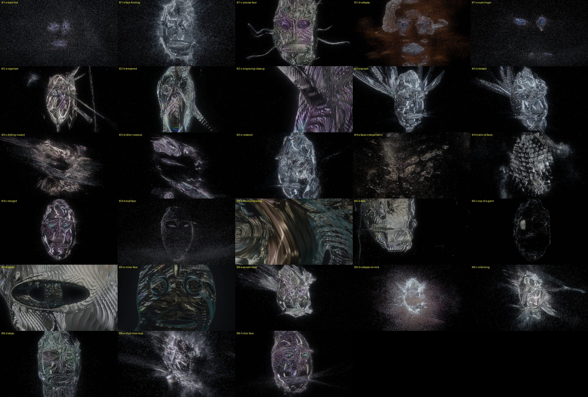
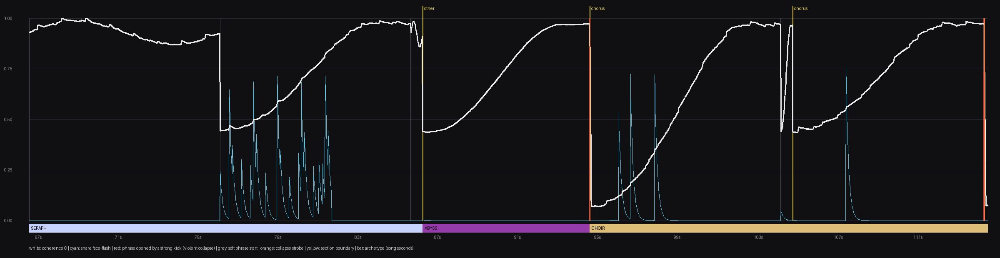

# The Astral Forge: The Six Tests, Performance and Assessment

Brief §18-20. Every test runs on the hybrid architecture E (`04-architecture.md`) with 2M particles, a 192³
density grid (a 12.5-unit box for TEST 04, 20 units otherwise) and 1920×1080. Every clip is a straight
render of the prototype at 30 fps. There is no compositing, grading or editing after render.

**Media** (on the Desktop, too large for git): `~/Desktop/av-gen-review/37-astral-forge/`

- `clips/t01.mp4` … `t05.mp4`: silent, because they are scripted.
- `clips/t06-audio-trench.mp4`: with the song.
- `stills/`: 28 named stills, each with a `-grey` copy for the desaturation check; `_contact.png` is the index.
- `sheets/`: one frame per second for each test, colour and grey.
- `approaches/`: A-E at the same three moments.

**Reproduce:** `prototypes/astral-forge/tools/render_clips.sh [tests]`, under the GPU lock (it calls
`tools/gpu-lock.sh` itself).

## Tracks

| Test | Audio |
|---|---|
| 01-05 | none. These tests are scripted (coherence, fold, camera are keyframed curves) and their clips are silent, so nothing in them can be mistaken for audio sync |
| 06 | **Trench** (`assets/audio/trench.wav`, the owner's test song: 207.6 s, 48 kHz, 24-bit), excerpt 66.54-114.54 s |

*Trench* was set as the test song during the work. The first TEST 06 cut used *Fireballs* (the heaviest
mix found locally: -8.9 dB RMS, 11.8 dB crest, the noisiest midrange). That cut was replaced and not kept.
*Fireballs* remains the only secondary check (`--song`). Both are analysed with production's
`AnalysisTrack` and `detectStructure`.

*Trench* as the analyser sees it: 100 BPM, 342 beats, 155 kicks, 260 snares, and 7 sections. Those
sections are a verse to 47.4 s, a verse to 86.3 s, a short break ("other", 86.3-94.6 s, the quietest part), then
choruses to 200.2 s and an outro. The detector puts every repeat in one repetition group, so the
conductor keys archetypes on (section function, group). The excerpt crosses the verse → break → chorus
boundaries, with kick-opened phrases at 94.6 s and 114.4 s.

## Evaluation scale

Each test is scored against the brief's ten §19 criteria, each from 0 to 3 (0 absent, 1 weak, 2 working,
3 strong), by my own judgement of the full-resolution frames and the clip. Where I ran the Creative Critic,
its measured results are quoted. The Critic measures film craft (motion, flashes, repetition, AV
correlation); it cannot judge whether a face is a face, so form and originality are my calls.

---

## TEST 01: CHAOS → FACE

**Verdict: PASS.** `clips/t01.mp4` (14 s), stills `t01-*`.

What happens:

| Time | What is seen |
|---|---|
| 0-2.5 s | Pure dust. Curl-advected flakes cluster weakly on a drifting noise iso-surface, giving clots and voids but no anatomy |
| 3.0 s (C ≈ 0.17) | **Two eyes**, as glittering condensations, before anything else exists |
| 4.0 s (C ≈ 0.25) | **Eyes over a mouth**: the T-configuration of pareidolia. The face is first read here, from about 9% of the matter |
| 4.3 s and 6.2 s | Two 250 ms face flashes |
| 6-8 s | The plate assembles as patches of surface that merge, incomplete at the rim |
| 9-10 s | Temper rises through gold toward violet |
| 10.7-11.5 s (C = 1) | A precise engraved mask: almond eyes with three concentric pupils, a faceted right half, teeth in a slit mouth, filaments fraying out of the rim |
| 11.55 s | C drops from 1.0 to 0.2 in 0.1 s. The bound matter is thrown along the surface normal, heat is injected (a shower of forge sparks), the surface tears, and the bands strobe once |
| 12-14 s | The dust slows. **The eyes linger and re-bind first**, because their thresholds are the lowest |

| Form | Depth | Material | Microdetail | Emergence | Instability | Scale | Originality | Audio | Performance |
|---|---|---|---|---|---|---|---|---|---|
| 3 | 2 | 2 | 2 | **3** | 2 | 1 | 2 | n/a | 15.8 ms |

- **Emergent?** Yes. This is the test the architecture exists for, and it works: the face is *read*
  well before it *exists*, because the eyes bind first. A-E proved that only approaches C and E produce this
  (`04-architecture.md`).
- **The surprise:** the eyes outliving the collapse. They are the last matter released and the first
  re-bound, so the face haunts the dust. It is not scripted. It falls out of the threshold ordering.
- **Weak:** the plate reads as a mask *object* for about one second at full coherence. That is the
  closest the prototype gets to "a model". The filaments are thin and regular.
- **Critic** (`job_1a10e43dfcead8fcd`, preview): overall 0.99; four low findings ("wobble" on two moves,
  one shot that "keeps going after it stops showing anything new" during the formed hold, one repeated
  composition); no lighting, colour or technical issues.

## TEST 02: METALLIC FIELD (no face)

**Verdict: PASS.** `clips/t02.mp4` (12 s), stills `t02-*`.

An abstract organism (a twisted core with a lipped hollow, spiralling horns, a ribcage of curved fin
blades) at coherence 0.9-1.0. The camera orbits in, then ends in a MICRO close-up on the horn and body.

| Form | Depth | Material | Microdetail | Emergence | Instability | Scale | Originality | Audio | Performance |
|---|---|---|---|---|---|---|---|---|---|
| 2 | **3** | **3** | **3** | 1 | 2 | 2 | 2 | n/a | 23.8 ms |

- **Metal, not shiny.** The guilloché (rosette and barleycorn moiré, four octaves that resolve as the
  camera approaches) catches the strip lights in bands that move across the grooves as the form turns. The
  anisotropy is what does it. Greyscale holds completely (`img/t02-c-engraving-closeup-grey.jpg`).
- **Colour from physics.** The temper film slides gunmetal → straw → violet across the 12 s. Thin rainbow
  lines (the grating term) appear only where the grooves are at the right angle to a light band.
- **Microdetail survives inspection.** Close up, the second and third octaves of engraving appear inside
  the first.
- **Weak:** an early version cut the grooves as straight-line stripes and it read as *brushed aluminium*
  (a generic look). The fix was phase modulation, the defining property of rose-engine work. One horn seen
  edge-on still reads as a straight spear in the first seconds.

## TEST 03: DIMENSIONAL FOLD

**Verdict: PARTIAL PASS.** `clips/t03.mp4` (14 s), stills `t03-*`.

The Seraph (a symmetric mask with a crown of fanned blade-wings) at C ≈ 0.96 is folded and then
restored:

| Time | Fold |
|---|---|
| 2-4.5 s | twist |
| 3.5-6 s | the left eye recedes through depth |
| 5-7.5 s | the mouth stretches into a tunnel |
| 6-8.5 s | bend |
| 7-9 s | partial sphere inversion (folding inward), while morphing into the Abyss |
| 10-12.5 s | everything restores |

| Form | Depth | Material | Microdetail | Emergence | Instability | Scale | Originality | Audio | Performance |
|---|---|---|---|---|---|---|---|---|---|
| 2 | 2 | 2 | 2 | 2 | **3** | 1 | 2 | n/a | 30.1 ms |

- **Works:**
  - The twist and the receding eye stay anatomically suggestive. The face rotates, and one eye is suddenly
    too deep.
  - The tunnel mouth is a real hole through the form.
  - The engraving bends with the fold, because it is cut in the warped domain.
  - The restore is satisfying: the form re-forms out of its own torn matter.
- **Does not yet work:** the sphere inversion reads as the entity *tearing apart*, not folding through
  itself. It is because inversion moves the latent faster than the particles can follow, so the surface
  becomes dust in transit. It is still striking, but it is not the "a wing passes through itself" of the
  brief. The fix is in the next iteration: fold the *particles* through the same warp (advect them by the
  warp's time derivative), so matter is carried through the fold rather than re-attracted after it.
- **Cost:** 30 ms at the inversion. The warp makes the latent non-Lipschitz, the sharpening field needs
  many short steps, and the camera is close.

## TEST 04: CHOIR

**Verdict: PASS, with caveats.** `clips/t04.mp4` (15 s), stills `t04-*`.

The skin of a great mask is made of hundreds of small faces on a bent lattice (an axis-aligned lattice read
as windows, which is architecture, so it was bent like scales).

| Time | What happens |
|---|---|
| 0-4 s | The camera is close; each small face turns and drifts on its own rhythm |
| 4.5-8 s | They **synchronise**: every face turns to stare forward. Crowd into chorus |
| 8.5-11 s | They **merge**: the lattice dissolves into one large face with green-blue temper in the eyes |
| 12.5 s | Collapse |
| 13-15 s | The dust holds a faint *line drawing* of the face (`t04-d-dust-face`) |

| Form | Depth | Material | Microdetail | Emergence | Instability | Scale | Originality | Audio | Performance |
|---|---|---|---|---|---|---|---|---|---|
| 2 | 2 | 2 | 2 | 2 | **3** | **3** | **3** | n/a | 24.5 ms (lattice), 12.4 ms (merged) |

- **Strongest idea of the set:** "a face whose skin is faces" reads as the brief describes, and the merge
  plays as a climax.
- **Caveats:**
  - At mid distance the small faces read as *scales* or *rivets* rather than faces. They become faces
    only within about 8 units.
  - 2M particles spread over hundreds of faces give each face only a few thousand, so they are made more by
    the sharpening than by matter.
  - The vertical "curtains" of dust that appear as the choir re-forms (also seen in TEST 06) are on the
    edge of reading as columns. **Watch this.**

## TEST 05: SCALE RECURSION

**Verdict: PASS, the strongest test.** `clips/t05.mp4` (16 s), stills `t05-*`.

There is no cut. The camera's distance follows an exponential path from 0.22 to 95 units and back down
to 0.55 units:

| Time | What is seen |
|---|---|
| 0-2 s | **MICRO**: the rosette engraving and polish of an eye ring fill the frame. It reads as an abstract metal landscape |
| 3-4 s | the eye, then the mask |
| 5-8 s | **REVEAL**: the mask shrinks, and the unbound dust, until now just a haze, is revealed to have condensed into a **giant ghost mask eight times larger. The entity is its left eye** (`t05-c-eye-of-a-giant`) |
| 9-13 s | **INTERNAL**: the camera dives back. The mouth has opened into a portal; it passes the teeth |
| 14-16 s | **MICRO**: the small face inside the mouth, then its engraving |

| Form | Depth | Material | Microdetail | Emergence | Instability | Scale | Originality | Audio | Performance |
|---|---|---|---|---|---|---|---|---|---|
| **3** | **3** | 2 | **3** | 2 | 2 | **3** | **3** | n/a | 21.0 ms (reveal); up to 2× more in the MICRO close-ups (the surface fills the frame) |

- **Why it works:** the scale cue is never a building or a horizon (there are none). It is the *same
  matter* at three sizes: flakes, a mask made of flakes, a mask made of masks. The giant face is drawn
  only by the meta-scale drifters, so it is faint and deniable: "what the fuck am I looking at… that's a
  face… wait".
- **Weak:** the MICRO frames at 0-2 s and 14-16 s are pure surface with no particles. The flakes are
  capped at 2.5 px so they do not turn into a bokeh blizzard, so close up the surface stops looking made of
  matter. The fix is to render near flakes as real lit shards (geometry) instead of splats.

## TEST 06: AUDIO

**Verdict: PASS.** `clips/t06-audio-trench.mp4` (48 s, with *Trench* 66.54-114.54 s), stills `t06-*`, and
the conductor timeline below.

*Song seconds. White: coherence. Cyan: snare face-flashes. Red: a phrase opened by a strong kick (the
violent collapses). Yellow: section boundaries. Bar: the archetype each section summons.*

| Song time | Music | What the entity does |
|---|---|---|
| 66.5-76.1 | verse, phrase 7 (an odd phrase) | the **Seraph** holds at C ≈ 0.9-1.0 and *folds* (twist, then the eye recedes); camera DESCENT |
| 76.1 | phrase 8 opens softly | the form half-dissolves (C 0.92 → 0.45) and rebuilds through the phrase, with snares flashing the face on the backbeat (cyan) |
| 86.25 | section change → break | archetype → **Abyss** (huge tunnel mouth, inward-falling matter, deep violet temper); the camera REVEALs (pull out and return) |
| **94.61** | the chorus opens on a strong kick | **collapse**: C 0.97 → 0.08 in 90 ms, sparks, strobe, a lens-shake COLLISION. Archetype → **Choir**, which assembles from dust over the 16-beat phrase |
| 104.2-104.8 | short phrase, then a section boundary | a brief dip, then a re-form |
| **114.4** | kick-opened phrase | collapse again, at the end of the excerpt |

| Form | Depth | Material | Microdetail | Emergence | Instability | Scale | Originality | Audio | Performance |
|---|---|---|---|---|---|---|---|---|---|
| 2 | 2 | 2 | 2 | **3** | **3** | 2 | 2 | **3** | 13.5-24.1 ms |

- **Musically intentional?** Yes, at the level that matters. The *form* changes on the music's structure:
  - which god appears is decided by the section;
  - building and destroying follow 16-beat sentences;
  - the destruction lands on the chorus downbeat;
  - snares put the face in focus for 250 ms while it is still forming.

  Nothing scales with amplitude. Loudness touches only density weight and breath.
- **Critic** (`job_1a10e446484d18c9b`, preview, film audio supplied): overall **0.97**, musical
  synchronisation **1.0**. Measured audio RMS against visual change: **r = 0.643** over 4 s windows. The
  onset-locked brightness response is small (0.008 luma at a 333 ms lag), with high-band and onset responses
  at z ≈ 4.5-4.7. In other words, the picture follows the music's *energy and events* without pumping its
  brightness, which is the brief's distinction.
- **Critic findings, and my reading of them:**
  - "Camera shake / wobble" (1 medium, 3 low). The global-motion estimator sees the whole dust field
    streaming. The camera path is a smoothed pure function; the only deliberate shake is 0.25 s at a
    collapse. I take this as partly a measurement confound, and partly a real note that the dust's motion
    competes with the camera.
  - Two "long flash reads as overexposure" findings (0.4 s). These are the collapse sparks plus strobe.
    The note is fair: the strobe should decay within about 0.3 s.
  - "Repeated composition" (cut03 ≈ cut05): the camera grammar repeats DESCENT-from-the-same-side too
    often. The next iteration needs more camera vocabulary per phrase.
- **Weak:** the break section (86-94 s) is the quietest music, but the Abyss builds over it like any other
  phrase. A break should *hold* chaos, and the conductor has no "withhold" state.

---

## Performance (brief §16)

Per test, at the heaviest moment, under the lock. p50 / p90 of 240 frames. These ran while other agents
compiled (1-minute load 9-35), so treat them as upper bounds; the clean-machine A-E numbers are in
`04-architecture.md`. Raw data: `bench-tests.jsonl`.

| Test, moment | Frame | Simulation | Density | Surface | Flakes | CPU |
|---|---|---|---|---|---|---|
| T01 formed face, 10.8 s | 15.8 / 19.5 | 9.6 | 2.2 | 1.8 | 1.8 | 0.4 |
| T01 collapse, 12.2 s | 15.7 / 17.5 | 9.3 | 2.2 | 1.7 | 2.0 | 1.5 |
| T02 organism, 6 s | 23.8 / 26.8 | 5.2 | 2.2 | **14.4** | 1.8 | 0.2 |
| T03 inversion, 8.5 s | 30.1 / 45.4 | 9.2 | 2.1 | **15.0** | 5.2 | 0.2 |
| T04 lattice, 7 s | 24.5 / 30.9 | 6.6 | 2.0 | 9.8 | 5.8 | 0.2 |
| T04 merged, 11 s | 12.4 / 20.5 | 4.9 | 1.8 | 1.5 | 2.8 | 1.0 |
| T05 giant reveal, 7.5 s | 21.0 / 31.3 | 11.8 | 2.2 | 5.1 | 1.8 | 0.3 |
| T06 Abyss formed, song 90.5 s | 24.1 / 25.0 | 7.3 | 2.2 | **11.7** | 2.8 | 0.3 |
| T06 Choir from dust, song 95.7 s | 13.5 / 15.3 | 4.9 | 2.1 | 1.0 | 4.9 | 0.3 |

**What the numbers say:**

- **The simulation is the steady cost** (5-12 ms for 2M particles). It is lower in tests whose latent parts
  are cheap, and in chaos when few particles are bound.
- **The surface is the variable cost.** It is 1-2 ms when the entity is mid-frame and formed, and 10-15 ms
  when the surface fills the frame *and* the sharpening is on. Then every pixel marches a short step that
  evaluates the full latent: the warped Seraph, the organism's horns, or the Abyss's tendrils.
- **Fix for live use:** cache the latent as a second 3-D texture (a 128³ distance volume refreshed every
  few frames, which the warp makes affordable), and evaluate the analytic latent only in the last two
  steps. That would bound the surface near 3-4 ms.
- **CPU is flat** (0.2-1.5 ms). The conductor is about 60 floats a frame, and nothing is read back.
- **Verdict:** 1080p at 30 fps is reliable today on this M2 Max in every test. 1080p60 holds only when the
  entity is mid-frame. With the cached-latent change and 1.5M particles, 1080p60 everywhere looks
  reachable.

---

## What worked

1. **The latent as a force, never a picture.** It is the core decision and it is visibly right. A-E
   shows that drawing the latent (D) gives "a model wrapped in particles"; attracting with it gives
   emergence.
2. **Pareidolia ordering** (the eyes bind first). It gives the brief's "holy shit, that's a face" at
   about 25% coherence, from a handful of matter, and a free haunting after collapse.
3. **The temper film as the colour language.** It is a physical reason for violet, gold and blue on metal,
   and it reads as metal in greyscale. No hue is ever painted.
4. **Phase-modulated guilloché in the warped domain.** It turns "shiny blob" into "engraved artifact"
   and survives a 400× zoom through its octaves.
5. **The giant ghost mask (TEST 05).** It is made of the *same* matter, so scale becomes a perceptual
   event rather than a camera move.
6. **Collapse as release with momentum**, plus heat on a small fraction of flakes. It reads as violent
   without becoming a fireball.

## What looked generic (honest)

1. **The filament "whiskers" on the mask** (TEST 01, 05) read as insect legs or catfish barbels at
   distance: the cartoon-bug silhouette. They need to be less regular, branch, and taper into the dust.
2. **Mid-coherence dust clouds** (C ≈ 0.4-0.6, wide shots) drift toward the brief's banned "procedural
   noise blob" / glittery smoke when the camera is far away. The entity needs a stronger meso structure
   there (tendons and sheets of streaming flakes), not more particles.
3. **A first pass of straight engraving** read as brushed aluminium. Fixed (TEST 02 notes), but the
   lesson stands: straight anisotropy is stock.
4. **The Choir's small faces** read as rivets or scales at mid distance.
5. **The camera's DESCENT** repeats the same side and angle (the Critic's "repeated composition").
6. **Bloom over the collapse sparks** briefly risks the "energy ball" look. The heat fraction is already
   at 4.5% of the matter; the strobe should be shorter.

**Architecture check:** I read every still against the no-architecture rule. Nothing reads as a building,
arch, tower, gate or wall. The two near-misses were both fixed: a *grid* of choir faces (it read as
windows; now a bent lattice) and horn-spears in a symmetric fan (they read as a crown or sunburst; now
asymmetric). **Still to watch:** the dust "curtains" while the Choir re-forms.

## Recommended next iteration

In order of payoff:

1. **Carry matter through folds.** Advect particles by the time derivative of the warp (TEST 03), so a
   fold moves the matter instead of re-attracting it, and a wing can pass through itself intact.
2. **Meso-scale tendons.** Bind a share of the plate matter to *curves* on the latent (convolution
   skeletons: brow lines, cheek lines, jaw arcs), with a strong tangential flow. Render them as anisotropic
   streaks. This replaces the "whiskers" and the mid-coherence fog with tendons that stream into the form.
3. **Near-flake geometry.** Flakes within about 3 units of the lens become real lit shards (instanced
   quads with the glint BRDF), fixing the MICRO frames' "pure surface" look.
4. **Cached latent volume** (a 128³ distance texture) for the surface pass: 10-15 ms → about 3-4 ms in
   close-ups, which gets 1080p60 everywhere.
5. **Conductor vocabulary:**
   - a *withhold* state for breaks (chaos held, eyes only, the face flashes on snares and never completes);
   - camera choice per phrase from a larger set, never the same behaviour twice in a row;
   - a strobe decay under 0.3 s.
6. **The Machine God and the Chimera** are written but not yet featured in a test. Give them a TEST 06
   section each (the excerpt's sections summoned the Seraph, Abyss and Choir).
7. **Production path** (`04-architecture.md`), only after 1-4 confirm the look holds at 60 fps:
   - a `latent` field kind (an SDF force on particles);
   - a render-transient density volume from particles;
   - a density-iso ⊕ SDF mode in the SDF renderer;
   - thin film and anisotropy tangents in `pbr_shade.wgsl`, and a line-field material op.

   Each would carry an ADR in the 1140-1159 range.

## Engine impact

None. The prototype is isolated in `prototypes/astral-forge/` behind
`-DAVGEN_ASTRAL_FORGE_PROTOTYPE=OFF`. The only shared-file change is that option in the root
`CMakeLists.txt`, the same pattern as the GPU-world spike. No ADR was added, because no reusable engine
capability was added. No `src/`, `shaders/` or `tests/` file was touched, so the full suites were not
required; see the final report for this call.
