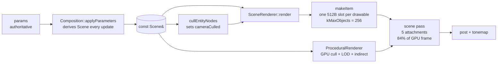
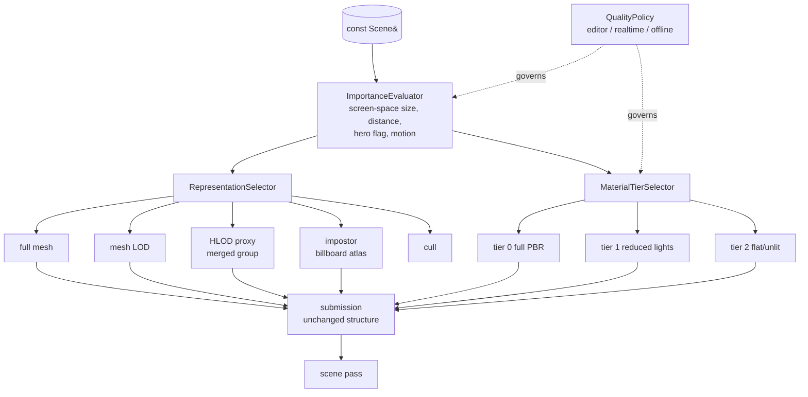
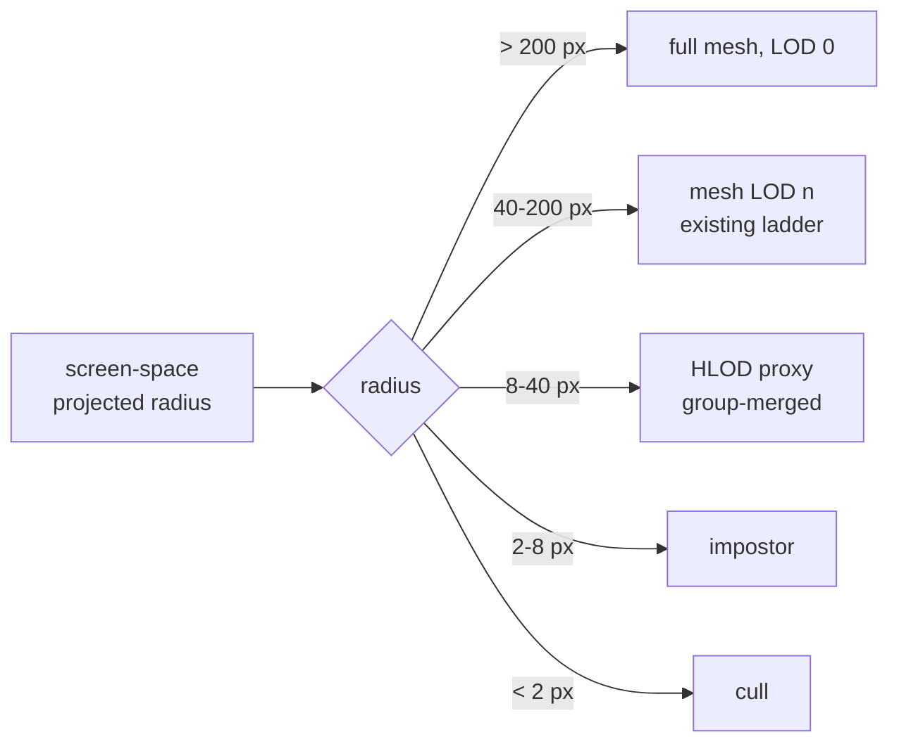
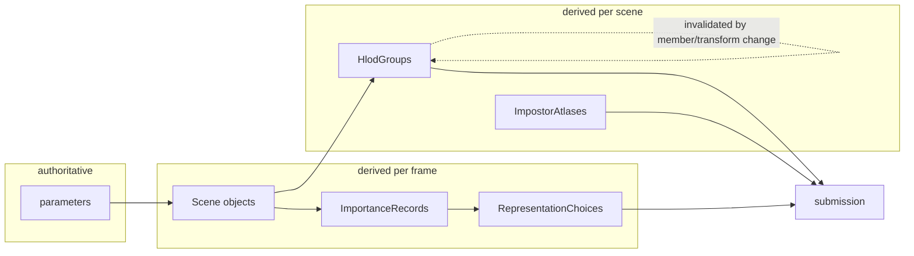
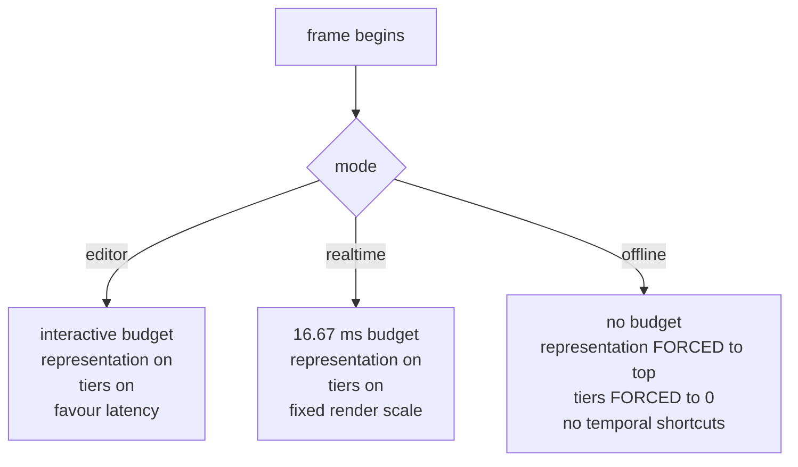

# Deliverables 5–9 — Target architecture, roadmap, risks, backlog, go/no-go

**Preparation phase. No implementation. Nothing here has been built.**

---

# The argument in one page

Three measured facts drive everything:

1. **The scene pass is 84% of Glowmere's GPU frame and is fragment-bound.** Vertex, binning and
   submission are **1.7%** of it — established by drawing the same 430 k triangles with a trivial
   fragment shader for 0.26 ms (depth prepass) and 0.66 ms (shadow, 792 k triangles).
2. **56% of the scene pass does not scale with resolution.** Eight times the pixels buys 2.1× the
   time: ≈9.0 ms fixed + 6.4 µs/1000 px.
3. **Neither workload is CPU-bound, draw-call-bound or triangle-throughput-bound.** 136 draws,
   0.66 ms CPU, and 24% more terrain triangles cost 3% more time.

Three research facts constrain the response:

4. **Nanite's rasterizer and virtual shadow maps are impossible on WebGPU** — both need 64-bit
   *texture* atomics; WGSL has neither 64-bit atomics nor texture atomics of any width.
5. **Dawn-on-Metal has no multi-draw indirect at all**, so GPU-driven submission cannot remove the
   per-draw CPU call it exists to remove.
6. **Epic warns Nanite is worst on aggregate geometry — "grass, leaves, hair"** — which is precisely
   Glowmere's content.

**The conclusion is uncomfortable and worth stating plainly: most of the techniques the brief names
either cannot be built on this stack, or attack costs this engine does not have.** The technique with
no capability blockers (hierarchical occlusion) attacks the 1.7%. The technique that would attack the
bottleneck (cluster LOD) is half-portable and is contraindicated for this content. GPU-driven
submission targets 0.66 ms. A frame graph targets a problem this engine has not been shown to have.

What *does* attack a fragment-bound, resolution-independent cost is **representation and per-pixel
cost**: fewer and larger triangles at distance, and a cheaper shader for pixels that do not deserve
an expensive one. That is the architecture proposed below.

**The gate measurement has been taken, and it settles the question.** At constant full-screen
coverage, sweeping only tessellation, the scene pass costs **4.9× more with sub-pixel triangles than
with 500-pixel ones** — 1.57 ms at 2,048 triangles against 7.73 ms at 2.1 M, identical pixels and
identical shader. The depth-pass control stays flat, so it is fragment work. The knee sits between
7.8 and 3.95 px/triangle, exactly the 2×2-quad threshold, and the ~4.6× ceiling matches the 4× a quad
predicts. **Quad overdraw is confirmed.** Done in-engine rather than through Xcode, so it is
reproducible and committed: `[.perf][fragment]`.

Glowmere averages **2.4 px/triangle**, and worse for the scattered ecology specifically.

**This makes representation the main line, not a hypothesis.** One caveat carried forward: two
screen-filling triangles cost *more* than 2,048 (3.02 vs 1.57 ms), so the cheapest point is a band of
a few hundred pixels per triangle, not the largest possible triangle. A representation system must
target that band rather than minimise triangle count.

---

# Deliverable 5 — Target architecture

## 5.1 Principle: the renderer is kept; a cost model is added

The current renderer is not structurally broken. The forensics investigation that preceded this found
eleven defects, **nine of them state ownership at a boundary and none in the transform chain, the
camera model or the GPU object path**. Those three are now the best-evidenced parts of the engine.

So this is **not** a rewrite proposal. It adds one thing the renderer currently lacks: **an explicit,
measured decision about how much a given object is worth per frame**, and two mechanisms that act on
that decision — one choosing a *geometric representation*, one choosing a *shading cost*.

## 5.2 Current architecture

Every drawable gets the same treatment: one uniform slot, one draw, the full PBR shader, all five
attachments. **There is no notion of an object deserving less.**

## 5.3 Proposed architecture

The two new decisions are **orthogonal** and that is deliberate: an object can be geometrically
simplified without being shaded cheaply, and vice versa. Conflating them is how quality settings
become a single unusable slider.

## 5.4 Representation selection

Thresholds are **placeholders to be calibrated against measurement**, not proposals. The structure is
the proposal. Note the ordering follows Epic's cost ordering — distance and frustum first, occlusion
last — and that the bottom two bands are where Glowmere's ecology lives.

**Why HLOD and impostors rather than a Nanite DAG:** both collapse *instances*, which is what
Karis says Epic's own artists hit first ("instances are the new triangles"), both are fully portable,
and neither carries the aggregate-geometry caveat. A cluster DAG remains a candidate for large
organic hero meshes, where its caveat does not apply.

## 5.5 Data structures

| Structure | Owner | Update | Lifetime | Why |
|---|---|---|---|---|
| `ImportanceRecord { entityIndex, projectedRadius, distance, isHero, screenVelocity }` | CPU, per frame | every update | one frame | inputs to both selectors; derived, never authoritative |
| `RepresentationChoice { kind, lodLevel, proxyId, impostorSlot }` | CPU, per frame | every update, **hysteretic** | one frame + previous | hysteresis needs last frame's choice to avoid flicker |
| `HlodGroup { bounds, memberEntities[], proxyMesh, proxyMaterial }` | CPU, built at scene load | on scene change | scene | a *derived copy* — must obey the derived-copy rule |
| `ImpostorAtlas { octahedralViews[N], texture }` | GPU, baked | on asset change | asset | 12×12 views is Nanite's figure; calibrate |
| `MaterialTier { lightBudget, shadowMode, auxWrites }` | CPU constant table | never | process | tiers are a policy, not per-object state |
| `QualityPolicy { tierThresholds, budgets, mode }` | CPU | on mode change | session | the one place editor/realtime/offline differ |

**Ownership rule, inherited and non-negotiable:** the parameter is authoritative, the `Scene` object
is a per-frame derivation. Every structure above is **derived**. `HlodGroup` is the dangerous one —
it is the first derived copy in this engine with a lifetime longer than a frame, and it therefore
needs an explicit invalidation rule or it becomes the tenth boundary defect. That rule is: *an
`HlodGroup` is invalidated by any change to its member set or any member's transform, and is rebuilt
at scene load and on edit; it is never consulted while invalid.*

## 5.6 Module boundaries

Proposed additions, named to match existing conventions, and deliberately few:

| Module | Responsibility | Why it is separate |
|---|---|---|
| `rendering::ImportanceEvaluator` | screen-space size, distance, hero, motion → one record per drawable | pure function of scene + camera; unit-testable without a device |
| `rendering::RepresentationSelector` | record → representation choice, with hysteresis | the flicker risk lives here and must be testable in isolation |
| `rendering::HlodSystem` | build and invalidate merged proxies | has the only long-lived derived state; needs its own invalidation tests |
| `rendering::QualityPolicy` | the tier tables and the editor/realtime/offline difference | one place to answer "why did this look different in a render?" |

**Explicitly not proposed:** `FrameGraph`, `GPUScene`, `VisibilitySystem`, `OcclusionSystem`,
`StreamingSystem`. Each is either blocked by the platform, unjustified by measurement, or premature.
Adding a module boundary with nothing behind it is how a renderer acquires abstraction without
capability.

`scene_renderer.cpp` is 3,182 lines and mixes seven concerns (Deliverable 1 §1.3). **It is not split
in this plan.** Splitting it is a large diff with no measured benefit, and the forensics work
established that this engine's defects live at boundaries — adding four new boundaries to a file
under active change is the highest-risk, lowest-reward move available. Revisit after Phase D.

## 5.7 Data flow and ownership

| Question | Answer |
|---|---|
| What is authoritative? | parameters, and the authored `*Rest` snapshots |
| What is rebuilt every frame? | Scene objects, importance records, representation choices |
| What persists? | HLOD proxies, impostor atlases, and last frame's choice (for hysteresis only) |
| What happens when an object moves? | its importance record and choice are recomputed; its HLOD group is invalidated |
| What happens on an editor edit? | the parameter changes → everything downstream re-derives; HLOD rebuilds |
| What does offline request? | the top representation and tier for every object, unconditionally (§5.9) |

## 5.8 Realtime quality policy

**Render scale is fixed per tier, never adaptive.** Dynamic resolution is explicitly deferred: the
brief warns against it before fixed render-scale support exists, and — more decisively — this
engine's scene pass is only 44% resolution-dependent, so halving resolution buys far less than the
naive model predicts. Measured: 640×400 is 0.26× the pixels of 1280×800 and 0.66× the scene time.

## 5.9 Offline policy — the non-negotiable part

Offline rendering must not inherit realtime compromises. Concretely:

- `RepresentationSelector` returns **the top representation for every object**, whatever its screen
  size. No HLOD proxies, no impostors, no LOD.
- `MaterialTierSelector` returns **tier 0 for every object**.
- Occlusion culling, if ever adopted, is **disabled offline** — a false negative that is invisible in
  realtime is a corrupted deliverable in a render.
- Temporal accumulation must reach a **converged** state per frame rather than relying on history
  across frames, or offline output depends on frame order.
- The `[gpu][composition][forensics][baseline]` frame-state baselines must pass unchanged in offline
  mode.

**The failure this prevents** is the one that matters most for an audiovisual engine: a render that
is silently lower fidelity than the preview it was approved from.

---

# Deliverable 6 — Phased roadmap

Ordered by dependency and evidence, **not** by the brief's suggested order, which front-loads
visibility and GPU-driven work this engine's measurements do not justify.

## Phase A — See the bottleneck ✅ **COMPLETE**

**Purpose.** Distinguish the two candidate causes of the resolution-independent cost.
**Method.** Originally specified as a Metal frame capture. **Revised: this repository does not use
Xcode tooling, so the measurement was built in-engine instead** — a tessellation sweep at constant
coverage (`[.perf][fragment]`). This is a better instrument for the purpose: reproducible, committed,
with its own control, and it runs without leaving the repository.
**Result.** Quad overdraw confirmed — 4.9× scene-pass cost from triangle size alone at identical
coverage, knee at the 2×2-quad threshold, depth control flat.
**Remaining Phase A items** (none blocking): the triangle-size histogram per subsystem, the
load/store audit, and p95/p99 in the harness.

## Phase B — Reduce per-pixel cost (no new systems)

**Purpose.** Attack the fragment cost with the levers already available, before building anything.
**Work.** `transient-attachments` on auxiliary targets never read outside the pass (Apple: load/store
"consume the majority of your app's system bandwidth"); correct any wrong load/store action; evaluate
`framebuffer-fetch` to fold a consuming pass into the scene pass; measure the clustered-light
evaluation cost per fragment and the cost of each auxiliary write.
**Exit criteria.** A measured reduction in scene-pass time at fixed resolution and fixed geometry,
≥2% GPU to count as a result. **Rollback.** Each item is independently revertible.
**Why first.** Cheapest, lowest-risk, no new abstractions, and it is the only phase that helps
*both* canonical workloads.

## Phase C — Representation scalability (the main line, if Phase A confirms)

**Purpose.** Reduce fragment *invocations* by making distant geometry fewer and larger triangles.
**Work.** `ImportanceEvaluator`; `RepresentationSelector` with hysteresis; impostors for the 2–8 px
band; HLOD proxies for the 8–40 px band.
**Exit criteria.** Glowmere scene pass reduced with **no visible popping** on the canonical camera
paths, and the frame-state baselines explaining every difference.
**Risks.** Popping; HLOD invalidation correctness; impostor bake pipeline is new asset infrastructure.
**Rollback.** The selector can return "full mesh" for everything, restoring current behaviour exactly
— and that is the fallback the tests should assert.

## Phase D — Material tiers

**Purpose.** Reduce per-invocation cost for pixels that do not deserve full PBR.
**Work.** `MaterialTierSelector`; a reduced-light and a flat variant per material program; tier
assignment from importance.
**Exit criteria.** Measured reduction with a documented visual delta on the canonical scenes.
**Risk.** Shader variant explosion — 36 WGSL shaders is already a lot to keep correct.

## Phase E — Lift `kMaxObjects`

**Purpose.** Remove a hard cap that Glowmere's own entity count (278) already exceeds.
**Work.** Replace the 256 × 512-byte dynamic-offset uniform layout with a storage buffer indexed by
instance (core WebGPU; 8 storage buffers available in the vertex stage).
**Exit criteria.** A scene with >256 visible entities renders correctly; the cap is replaced by a
mechanism, not raised.
**Note.** Deliberately *after* B–D: it is a correctness/scalability fix, not a performance one, and
it touches the object-slot path the forensics work just finished pinning.

## Phase F — Volumetrics (Constellation's separate problem)

**Purpose.** Constellation is 64% volumetrics and shares nothing with Glowmere's bottleneck.
**Work.** Froxel resolution as an explicit tier parameter; measure temporal reprojection of the
volume; measure the composite separately from the march.
**Exit criteria.** Measured reduction on Constellation with no change to Glowmere.

## Phase G — Certification

Stress scenes, scalability curves, frame pacing (p50/p90/p95/p99), visual comparison, offline output
verification, and the baseline snapshots green.

## Deliberately deferred, with the evidence that would justify each

| Deferred | Justified when |
|---|---|
| HZB occlusion culling | measured occlusion ratio > ~30% on a canonical scene **and** Unity's other two preconditions hold |
| GPU-driven submission | CPU encode time exceeds ~10% of frame, **and** Dawn-on-Metal ships multi-draw indirect |
| Frame graph | the load/store audit finds more than one or two wrong actions that a table cannot fix |
| Cluster/DAG LOD | Phase A shows sub-pixel triangles **and** the content is hero meshes rather than aggregates |
| World streaming | a scene exists that does not fit memory |
| Dynamic resolution | a fixed render-scale tier system exists and is insufficient |
| Splitting `scene_renderer.cpp` | after Phase D, when the new seams are known rather than guessed |

## Rejected outright, with the reason

| Rejected | Reason |
|---|---|
| Nanite software rasterizer | needs 64-bit texture atomics; WGSL has neither 64-bit nor texture atomics |
| Virtual shadow maps | same atomics wall; co-designed with Nanite's visibility buffer |
| Removing the depth prepass | Apple says HSR makes a *performance-only* prepass redundant, but this one feeds linear depth for AO, water and fog — and costs 0.26 ms |
| Removing the shadow mask | measured: removing it makes the scene pass **5.8 ms worse** |
| Reducing attachment count to fit tile memory | unfounded — five targets are 32 B/px against a 128 B/px budget |

---

# Deliverable 7 — Risk register

| # | Risk | Severity | Evidence / mitigation |
|---|---|---|---|
| 1 | **Phase A's measurement is inconclusive** and the 9 ms stays unexplained | **High** | the whole plan is gated on it; fallback is to A/B a deliberately cheapened fragment shader and infer from the delta |
| 2 | Representation popping | High | hysteresis; the engine has no TAA, and Nanite's seamlessness *depends* on TAA — so cross-fade or dithered transition is required, not optional |
| 3 | HLOD proxies become a stale derived copy | **High** | this engine's defect history is nine-of-eleven boundary-ownership bugs; explicit invalidation rule + tests before any proxy is drawn |
| 4 | Offline silently inherits a realtime compromise | **High** | §5.9; baselines must pass in offline mode; a render is a deliverable |
| 5 | Occlusion culling false negatives | High | deferred entirely; if adopted, disabled offline, and pixel-diff tested on a fixed camera path |
| 6 | Dawn-on-Metal capability drift (multi-draw, PLS) | Medium | no plan depends on an unshipped capability; re-check at each phase |
| 7 | Shader variant explosion from material tiers | Medium | tiers are a small fixed table, not a per-material matrix |
| 8 | WebGPU portability lost by raising device limits | Medium | already at exactly 32 B/sample; **any new attachment breaks compat mode** — treat the five targets as a hard budget |
| 9 | Benchmark conclusions drawn across sessions | Medium | protocol in Deliverable 3; within-session spread is 1.0% GPU, cross-session gaps of 28% have been observed |
| 10 | `scene_renderer.cpp` grows further | Low | accepted deliberately until Phase D |
| 11 | Impostor bake becomes new asset-pipeline surface | Medium | scope to procedural/scatter assets first, which are generated rather than authored |

---

# Deliverable 8 — Implementation backlog

Phase A only is specified to task level; later phases are specified after A resolves, because A
determines whether C or B is the main line. **Specifying C's tasks now would be planning on a
hypothesis.**

| Task | Objective | Depends on | Files | Tests | Acceptance |
|---|---|---|---|---|---|
| **A1** Metal capture protocol | document how to take a GPU capture of a headless run and read overdraw ratio, fragment/vertex split, limiters | — | `docs/renderer-upgrade/` | — | another engineer can reproduce the capture from the doc |
| **A2** Overdraw ratio, Glowmere | fragment invocations ÷ pixels stored at 1280×800 | A1 | — | — | a number, with the capture archived |
| **A3** Triangle-size histogram | CPU-side: per drawable, projected bounds area ÷ triangle count, bucketed | — | new test-only analysis in `tests/rendering/` | `[gpu][renderer][analysis]` | histogram for Glowmere and Constellation, committed as data |
| **A4** Load/store audit | enumerate all five attachments' load and store actions per pass; flag any load of an overwritten target or store of an unread one | — | read-only audit | — | a table; a count of wrong actions |
| **A5** Clustered-light cost probe | A/B scene-pass time with light count reduced, at fixed geometry and resolution | — | temporary scene variants | — | ms per light per pixel, or a bound |
| **A6** Extend the harness to p95/p99 | the protocol asks for them; the harness reports p10/p90/min | — | `render_stats.cpp` | `[unit][stats]` | percentiles reported and unit-tested |
| **A7** Transient-attachment feasibility | confirm Dawn exposes `transient-attachments` on this device and which of the five targets qualify | — | read-only probe | — | yes/no per target, with the constraint list |

---

# Deliverable 9 — Go / no-go recommendation

## Implement first

**Phase A is complete and its gate is passed.** Quad overdraw is confirmed, so **Phase C
(representation: importance → LOD / HLOD / impostors) is the justified main line**, with **Phase B**
(transient attachments, load/store correctness, per-pixel cost) running alongside it as low-risk
platform hygiene that helps both canonical workloads.

Then **Phase B**, which is low-risk platform hygiene that helps both workloads and adds no systems.

## Defer

HZB occlusion, GPU-driven submission, frame graph, cluster/DAG LOD, world streaming, dynamic
resolution, and splitting `scene_renderer.cpp` — each with its justifying evidence named above.

## Do not attempt

Nanite's software rasterizer and virtual shadow maps. Not "hard" — **impossible on this stack**, for
a specific and verifiable reason: WGSL has no 64-bit atomics and no texture atomics, and Dawn exposes
no path to Metal's. Any plan containing them is a plan to fork Dawn and leave WebGPU.

## Needs a prototype before commitment

**Impostors and HLOD proxies for the 2–40 px band.** This is the main line if Phase A confirms quad
overdraw, and its two risks — popping without TAA, and stale proxy state — are exactly the kind this
engine has a documented history of. Prototype on Glowmere's ecology alone, behind an arm, measured
against the frame-state baselines.

## Needs more research

- **Transition quality without TAA.** Nanite's seamless LOD is contingent on temporal AA, which this
  engine does not have. Cross-fade, dither, and stochastic alpha each need evaluation, and this is
  the single largest unknown in Phase C.
- **Whether `framebuffer-fetch` can fold any of this engine's passes.** High potential value on TBDR,
  entirely unexplored here.

## Needs your approval

1. **Spending Phase A on Xcode GPU capture.** It is tooling this repository has never used, and it
   gates the rest. I recommend it, but it is a real cost.
2. **The ordering inversion.** The brief's suggested Phase C is visibility; I am proposing that
   visibility work be deferred behind representation and per-pixel cost, because the measurements say
   geometry work is 1.7% of the bottleneck pass. **This is the most consequential disagreement
   between this proposal and the brief, and it should be an explicit decision rather than something
   absorbed silently.**
3. **Accepting that `scene_renderer.cpp` stays large** until Phase D.

## What changed this recommendation, and what still could

Phase A ran and returned 4.9×, not 1.0. Had it returned ≈1.0 the diagnosis would have inverted and
material tiers would be the main line instead. It cost one afternoon to find out rather than one
quarter, which was the point of gating.

**What could still change it:** the sweep establishes the mechanism on a synthetic plane with a
simpler shader than Glowmere's. If Phase C's first task — measuring Glowmere's scene pass before and
after a representation change on the ecology alone — shows a small delta, then quad overdraw is real
but is not where Glowmere's 15.7 ms actually goes, and the per-pixel work of Phase B becomes primary.
That measurement is the first thing Phase C does, before any system is built.
