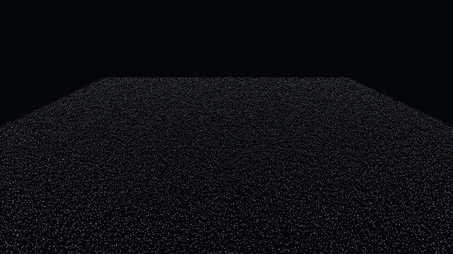
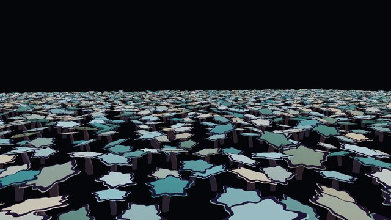
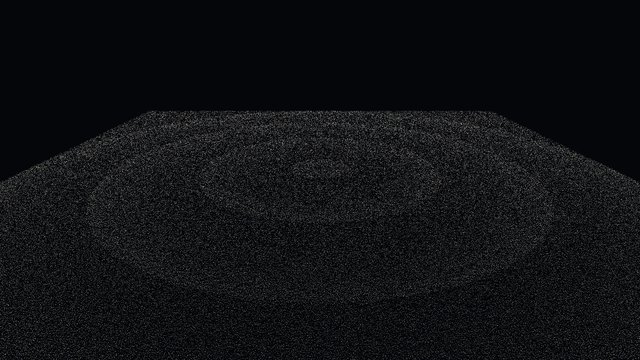
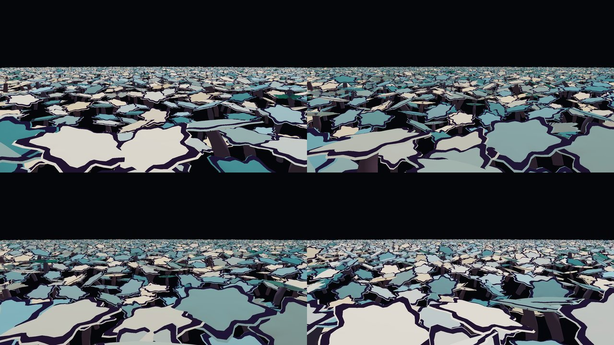
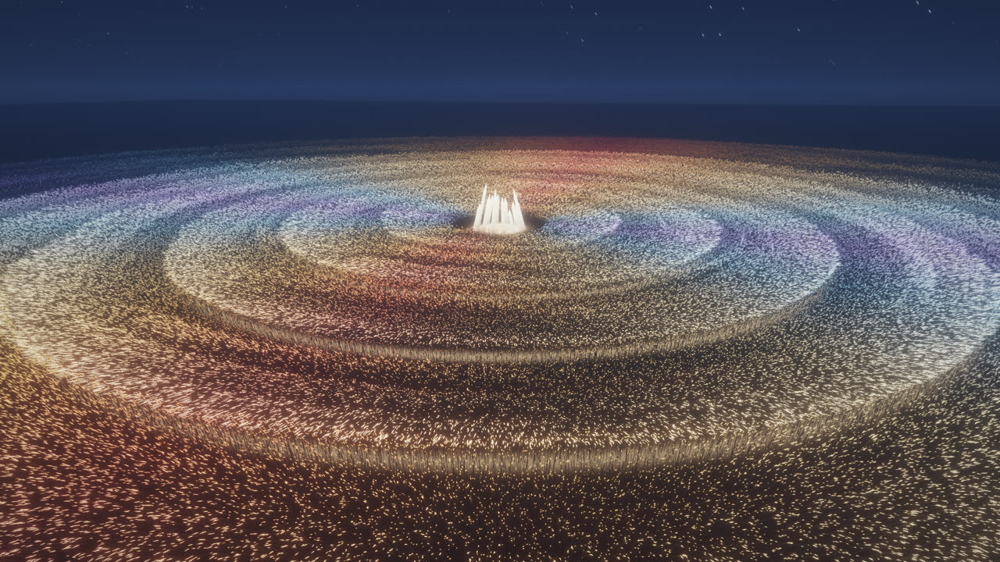
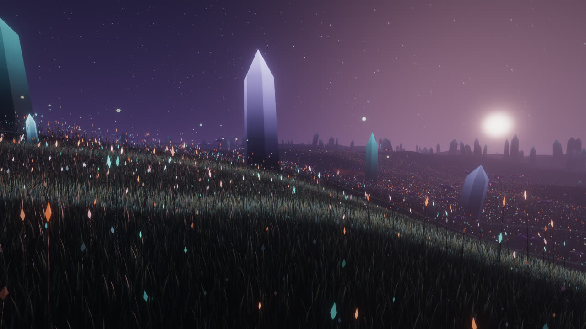
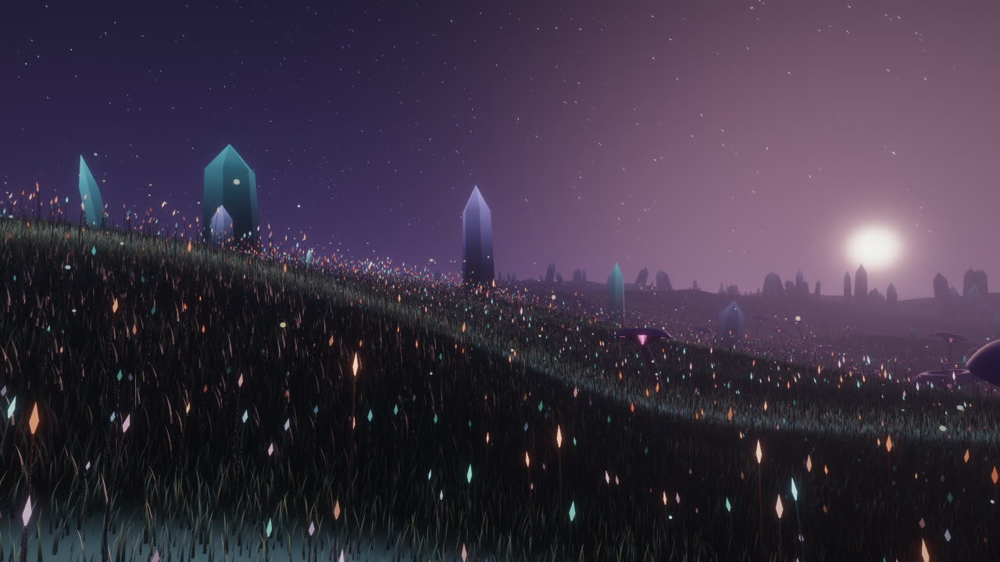
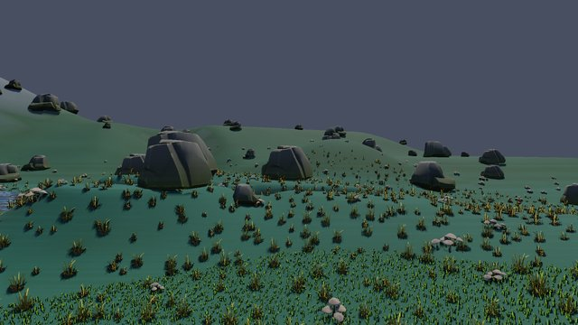
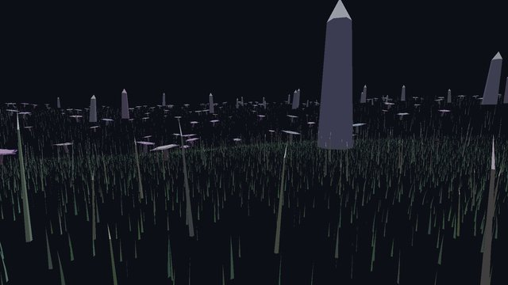

# GPU World Architecture: research spike

Branch `research/gpu-world`, from main `ba0003de`, started 2026-10-04. The brief is
`docs/research/gpu-world-brief.md` (the owner's, verbatim). Machine: Apple M2 Max (38-core GPU, 64 GB),
macOS 26, Dawn/WebGPU on Metal. All GPU runs went through `tools/gpu-lock.sh`.

**Status:** Phase 4 complete (code agent, 2026-10-05). Gate 0: PASS (narrow). Gate 1: CONDITIONAL PASS.
Gate 2: CONDITIONAL PASS. Gate 3: PASS (art agent). **Gate 4: PASS.** Phase 5 (architecture proposal)
follows.

## Hypothesis (from the brief)

> AV Gen may be able to represent certain audiovisual worlds as compact procedural descriptions whose
> expensive population, animation, culling, and simulation happen primarily on the GPU, reducing CPU
> scene/entity overhead while enabling visual systems that are impractical with conventional
> CPU-managed entities.

Scope note (coordinator, mid-spike): Phase 3 (new-art experiment) is handed to a separate art agent.
This spike runs Phases 0-2 at most, then writes a Phase 3 handoff.

---

## Phase 0: Architecture Reconnaissance

Read-only. No production code changed. Sources: the code paths cited below, `docs/gpu-culling-lod.md`,
`docs/gpu-fields.md`, `docs/performance/procedural-geometry.md`, `docs/particle-lab/README.md`,
`docs/live-optimizer/01-research.md`, ADR-097, ADR-273, ADR-700, and the live-optimizer stream's live
profiles of the three real scenes (`~/Desktop/av-gen-review/31-live-optimizer/data/raw/A2-*`, measured
2026-10-03 on this machine).

### 1. The current execution path

```
audio/MIDI/OSC -> signal bus -> Modulator::applyRoutes (per route, per frame)        [CPU]
timeline -> Composition (node tree) --flatten on structural change--> scene::Scene   [CPU]
  per frame: entities (EntityWorld: behaviours, character AI, reactions -> ModRoutes) [CPU]
             floaters / terrain LOD / ecology lights / camera                          [CPU]
SceneRenderer::render
  entities & meshes: CPU frustum cull, per-draw uniforms, one draw per part           [CPU encode]
  ProceduralRenderer::update (scatter layers, cities, imported-asset scatters):
    instance records uploaded ONLY when structureVersion changes                      [CPU -> GPU, rare]
    effector compute pass (fields move/scale records)                                 [GPU]
    cull + LOD compute pass (classify, scan, scatter, indirect args, no atomics)      [GPU]
    drawIndexedIndirect per LOD level, deformers (wind, twist, field) in vertex stage [GPU]
    ADR-056 vegetation sim: CPU integrates only a budgeted active set near camera      [CPU, bounded]
  ParticleRenderer: emit / simulate / scan / indirect draw, all compute               [GPU]
  SDF raymarch, volumes, post                                                          [GPU]
```

### 2. Where CPU work grows with scene complexity

| Cost | Grows with | Measured where | Size today |
|---|---|---|---|
| Composition flatten (`Composition::rebuild`) | node count, terrain, scatter generation | `docs/application-performance.md` | 620-942 ms cold; **0 flattens per frame during playback or scrub** (measured, 97 seeks) |
| Entity update (`EntityWorld`) | bodies x behaviours x reactions | live profile "scene update" | Glowmere (96 entities, 22 characters): **1.55 ms**; Liminal 1.09; Sonic 1.01 |
| Entity seek re-simulation | bodies x replayed steps | ADR-267/273, ADR-700 | was 2.4 s per click (161 s at 100 characters); **fixed by ADR-700 checkpoints** (replays at most 1 s) |
| Modulation routes | routes | live profile | Glowmere 0.45 ms |
| Procedural instances per frame | nothing (records are GPU-resident) | `docs/performance/procedural-geometry.md` | microseconds; 0.19 ms submission in Glowmere for 62k instances |
| Floaters (`Composition::updateFloaters`) | **instances, every frame**: CPU evaluates, rewrites 96 B records, bumps `structureVersion` -> full re-upload + bounds rebuild | code read | **used by no example scene** |

**The most important Phase 0 fact, and the strongest evidence against the hypothesis:** all three
shipped live scenes are GPU-bound, not CPU-bound. Live mode, 1080p projection, auto 60 (A2 runs):

| Scene | CPU work p50 | of which scene update | GPU p50 | Critical path |
|---|---|---|---|---|
| Glowmere valley 2 (22 characters) | 4.91 ms | 1.55 ms | 11.27 ms | GPU (130% of interval) |
| Liminal (all-you-got) | 3.14 ms | 1.09 ms | 11.47 ms | GPU |
| Sonic live | 3.72 ms | 1.01 ms | 13.17 ms | GPU |

Glowmere draws 716 of 61,869 procedural instances; the other 61k are culled on the GPU already.
The renderer forensics/upgrade and live-optimizer work found GPU per-pixel cost (scene shading, SDF,
volumes, motion blur) dominant: Glowmere 86% per-pixel, Liminal 97%. Removing *all* CPU scene work
from these scenes would not raise their frame rate.

### 3. Where data crosses CPU/GPU boundaries

- Per frame, small: object uniforms (768 B per procedural LOD level), cull uniforms (256 B), the
  `FieldBlock` (5,136 B), per-entity draw uniforms, light and cluster data.
- On structural change: instance records (96 B per instance), meshes, textures (an unconditional
  `textureVersion` bump re-uploads all 44 textures on a hero star: 1.1 s, `av-gen-ui-responsiveness`).
- Readbacks: cull stats and timestamps, asynchronous, a readout never an input (ADR-029).
- The one per-frame O(N) upload: floaters (`structureVersion` bumped every frame).

### 4. GPU-driven techniques already in production

This is the second fact that reshapes the spike: **most of the brief's experimental arm B already
exists in AV Gen and ships.**

| Brief's list | In AV Gen | Where |
|---|---|---|
| compute shaders, storage buffers | yes | effectors, cull, particles, simulation, volumes |
| GPU-generated instance data | partial: records are CPU-generated once, GPU-modified by effectors per frame | `points.wgsl` `cs_effectors` |
| indirect drawing | yes | `cull.wgsl` -> `drawIndexedIndirect` per LOD; particles |
| GPU-side animation | yes, in the vertex stage (wind, twist, bend, field deformers) and effector pass | `procedural.wgsl`, `points.wgsl` |
| GPU-side culling + LOD | yes, deterministic prefix-sum compaction, no atomics | ADR-029 |
| GPU-resident simulation state | yes for particles; vegetation dynamics are CPU-integrated (bounded set) and uploaded | ADR-015, ADR-056 |
| procedural generation | CPU at flatten (scatter, terrain, trees, mushrooms) | `scene/procedural.cpp`, `world/*` |

Measured costs already on record (M2 Max): cull pass 0.06 ms / 100k, 0.35-0.38 ms / 1M; effector
pass 1.1-1.4 ms / 1M records (analytic field), 4.6 ms with curl noise; 1M point billboards 3.1 ms
draw at 1080p; CPU microseconds per frame.

### 5. Candidate workloads

| Candidate | Plausible advantage? | Why |
|---|---|---|
| Static scatter (grass, fungi, rocks) | **No** | already GPU-resident, GPU-culled, indirect-drawn |
| Character entities (AI, navigation, perception) | **No** | stateful, branching, few (22-250); belong on the CPU; their seek cost is fixed (ADR-700) |
| Flatten cost | **No** for playback | it does not run per frame; it is an editing-latency problem, not a frame-time one |
| **CPU-animated instance populations** (floaters; any "N things each doing their own motion with per-instance state") | **Yes, plausibly** | the only CPU path that is O(N) per frame plus an O(N) re-upload; a GPU arm is O(1) CPU |
| **Per-instance audio-reactive populations** | **Yes, plausibly** | audio reaches populations today only as per-object uniforms or through ≤16 fields modulated per route; per-instance divergent response (own band, own phase, travelling kick wave) has no production path other than one entity per element, which costs a ModRoute per reaction per frame |
| Million-element fields, generated-around-camera worlds | maybe (Phase 3/4 questions) | particles cover part of it already |

### 6. Control cases

- `Composition::updateFloaters` is the production embodiment of Control A (CPU evaluates a pure
  function of time per instance, packs records, re-uploads every frame). The prototype's CPU arm
  replicates that shape, with a CPU frustum pre-cull added so the control is not a straw man.
- `ProceduralRenderer` (records GPU-resident, GPU cull, indirect draw) is what Experimental B must
  beat or match; the prototype's GPU arm is a minimal version of it plus per-frame GPU animation.

### Gate 0 decision: **PASS (narrow)**

There is at least one workload with a plausible, measurable advantage: a population whose every
element animates (and later reacts to audio) per frame. On the CPU that is O(N) evaluation plus an
O(N) upload every frame; on the GPU it is a fixed-size uniform write. Phase 1 measures whether that
difference is material.

Two qualifications written down now, before any prototype exists, so the result cannot drift past
them:

1. The real scenes are GPU-bound with 1-1.5 ms of scene update. A CPU win in the prototype will not
   speed up any shipped scene; it can only make *new* content affordable.
2. The GPU path the hypothesis describes is largely already built. The live question is narrower than
   the brief's framing: is *per-frame GPU animation of per-instance state* worth adding, given the
   static GPU population path already exists?

---

## Phase 1: Controlled GPU Population Benchmark

### Experiment design

Prototype: `prototypes/gpu-world/gpu_world_bench.cpp` (~900 lines, one file), built only with
`-DAVGEN_GPUWORLD_PROTOTYPE=ON` (target `avgen_gpu_world_bench`). It links `avgen_gpu` read-only for the
Dawn context, `gpu::FrameTimeline` (the production GPU timestamp instrument), texture readback and the
production mushroom generator. No production file changed apart from the three-line CMake option.

One population of a simple asset. Every element animates every frame: a bob, a two-axis sway, a slow
yaw, a scale pulse and an emission pulse, each with a per-instance phase. The animation is a pure
function of (rest record, time), like `evaluateFloaters`. Four arms share the draw shader, the mesh,
the animation maths (C++ and WGSL written operation for operation), the cull rule, the camera and the
1920x1080 target. Only where the per-frame instance data comes from differs.

| Arm | Per frame on the CPU | Per frame on the GPU |
|---|---|---|
| `cpu` (Control A) | per instance: conservative pre-cull on the rest position, animate, exact frustum and distance cull, pack a 48 B record; one `WriteBuffer` of the survivors | one `DrawIndexed` |
| `cpumt` (Control A, strongest) | the same split across a persistent 8-thread pool | same |
| `cpugrid` (Control A, world) | a uniform XZ grid built once; visit only cells whose box reaches the frustum and the max distance (ADR-056's idea) | same |
| `gpu` (Experimental B) | write one 304 B uniform block and the 20 B indirect args | one compute dispatch: animate, cull and append survivors (workgroup-aggregated atomics) into a compact buffer, then one `DrawIndexedIndirect` |

Scenarios:

- **field** (the population is the shot): a 200 m square of N elements seen from above at an angle,
  so ~82% are on screen at every N. Asset: an 8-triangle "firefly" octahedron. It is cheap to draw, so
  the population cost is visible rather than buried under raster cost.
- **world** (a big world, a nearby camera): the population is spread at constant density over a square
  of side √N metres. The camera stands at eye height and culls at 120 m, so ~10k are visible whatever
  N is. Asset: the production procedural mushroom (`organism::buildMushroom` at the schema's
  midpoint, 6,010 triangles, flattened to one mesh with per-part colour and an emissive mask). This is
  the realistic case: heavy asset, most of the world off screen.

Protocol: Release build. 60 warm-up frames, then 300 measured frames, with two frames in flight (the
CPU waits on the frame before last, as a live loop does). Each (N, arm) ran twice, with the arm order
reversed on the second repeat. Every run went through `tools/gpu-lock.sh`, and every run waited for
the 1-minute load average to fall under 4. **The first full matrix was discarded:** another agent was
compiling (load 18-58, seven clang processes at 90%+). It is kept in `data/contended/` for transparency.
Cells show the p50 of the two runs' per-run p50s, with the range of the two in brackets.

Instrument limits: GPU times come from `gpu::FrameTimeline`, whose resolution here is about 0.066 ms.
A "0.000" GPU compute value means "under one tick", not zero. "CPU frame" is the CPU work for the
frame: update, upload, encode and submit, excluding the wait for the GPU. "Frame interval" is the
wall-clock time between frame starts, so it is the end-to-end cost.

### Results: field (firefly, 8 triangles), everything animated and ~82% visible

Data: `docs/research/gpu-world/data/p1-firefly-field.{jsonl,table.md}`.

| N | visible | CPU frame ms: cpu / cpumt(8) / gpu | upload B/frame: CPU arms / gpu | GPU frame ms: cpu / gpu (compute part) | frame interval ms: cpu / cpumt / gpu |
|---|---|---|---|---|---|
| 1,000 | 857 | 0.080 / 0.093 / 0.051 | 41 KB / 324 B | 0.07 / 0.13 (<0.07) | 0.43 / 0.45 / 0.54 |
| 10,000 | 8,259 | 0.53 / 0.18 / 0.053 | 396 KB / 324 B | 0.26 / 0.26 (<0.07) | 0.63 / 0.64 / 0.68 |
| 100,000 | 82,498 | 4.94 / 0.98 / 0.059 | 3.96 MB / 324 B | 0.79 / 0.46 (<0.07) | 4.94 / 1.08 / 0.81 |
| 1,000,000 | 819,299 | 50.4 / 11.4 / 0.33 | 39.3 MB / 324 B | 4.85 / 2.29 (0.20) | 50.4 / 11.4 / **2.71** |
| 4,000,000 | 3,275,701 | 202 / 43.3 / 0.64 | 157 MB / 324 B | 16.3 / 8.78 (0.72) | 202 / 43.3 / **9.24** |

(`cpugrid` tracks `cpu` within 5% here; when everything is on screen a grid has nothing to skip. The
full table is in the data folder.)

 

### Results: world (mushroom, 6,010 triangles), ~10k visible whatever N is

Data: `docs/research/gpu-world/data/p1-mushroom-world.{jsonl,table.md}`.

| N | visible | CPU frame ms: cpu / cpumt / cpugrid / gpu | GPU frame ms (all arms) | frame interval ms: best CPU arm / gpu |
|---|---|---|---|---|
| 1,000 | 235 | 0.086 / 0.18 / 0.13 / 0.071 | 0.59-0.79 | 0.93 / 1.00 |
| 10,000 | 2,278 | 0.71 / 0.51 / 0.87 / 0.21 | 2.29-2.36 | 2.70 / 2.69 |
| 100,000 | 10,283 | 2.57 / 1.96 / 2.30 / 0.31 | 7.67-7.86 | 8.12 / 8.34 |
| 1,000,000 | 10,246 | 3.95 / 2.54 / 2.39 / 0.45 | 7.80-7.90 | 8.22 / 8.37 |



### Correctness and equivalence

- **The visible counts are identical** in every arm at every N (for example 819,299 at 1M field and
  10,246 at 1M world), so all arms draw the same set.
- **Image comparison**, at the same frame (t = 10.5 s) and the same camera, using 8-bit sRGB output:
  - field 100k, CPU vs GPU: 12 of 2,073,600 pixels differ by more than 2/255 (max 66, mean 0.0001);
  - world 10k mushrooms: 187 pixels (max 182, mean 0.007).
  These are silhouette pixels. GPU `sin`/`exp` and libm differ in the last bits, and that moves an
  edge by under a pixel. The images are equivalent, but not bit-identical.
- **GPU run-to-run**: two fresh runs gave byte-identical images, even though the append order of the
  workgroup atomics is not guaranteed. The depth test hides the order for opaque geometry. Translucent
  or additive geometry drawn in that order would not be stable (see the Bad-Idea list).

### Profiling observations

- **The CPU arms scale linearly with N.** That is about 50 ns per element on one core (animate, cull
  and pack), plus about 3.1 ms of `WriteBuffer` per million visible elements (39 MB). Eight threads
  give 4.4-4.7x on the update, but the upload does not parallelise: at 1M it is 3.5 ms of the 11.4.
- **The GPU arm's CPU cost is flat:** 0.05-0.06 ms up to 100k. At 1M-4M it is 0.3-0.6 ms, all of it
  encode and submit. That is Dawn's per-submit overhead, not population work.
- **The GPU compute pass is cheap:** 0.20 ms at 1M and 0.72 ms at 4M (animate, cull, append), against
  a draw of 2.1 and 8.1 ms. These agree with the production effector pass (1.1-1.4 ms per 1M records
  for an analytic field), which moves twice the bytes per record.
- **Surprise:** the CPU arms' *GPU* frame is longer than the GPU arm's (4.85 vs 2.29 ms at 1M, 16.3
  vs 8.8 at 4M), even though they draw the same instances. The likely cause is the 39-157 MB per-frame
  staging copy landing in the same timeline. It was not isolated further; it does not change the
  conclusion.
- **Memory:** the CPU arms hold a rest array plus a full staging array: 76 MB at 1M, 305 MB at 4M.
  The GPU arm holds the rest array on the GPU (32 B/element) plus the output buffer (48 B/element),
  30.5 MB of CPU-side rest copy at 1M (which could be dropped after upload), and uploads 324 B a
  frame against 39 MB. No arm grew its footprint over 300 frames.
- **The world scenario is GPU-bound in every arm** (7.8 ms of mushroom raster for ~10k visible). The
  GPU arm cuts CPU work 5.3x at 1M (2.39 → 0.45 ms against the best CPU control), and the frame is
  *0.15 ms slower* (8.37 vs 8.22). That is the Phase 0 finding reproduced in miniature: when the GPU
  is the bottleneck, freeing the CPU buys nothing.

### Gate 1 decision: **CONDITIONAL PASS**

Against the brief's targets:

| Target | Result |
|---|---|
| ≥2x less CPU work at meaningful sizes | **Met.** 16x at 100k against the 8-thread control (0.98 → 0.06 ms), 35x at 1M (11.4 → 0.33), 68x at 4M; 5.3x in the GPU-bound world at 1M |
| dramatically better scaling | **Met.** The CPU is flat in N, against linear for every CPU arm |
| substantially less CPU/GPU traffic | **Met.** 324 B/frame against 4 MB (100k), 39 MB (1M) and 157 MB (4M) |
| materially larger feasible population | **Met for cheap elements.** At a 60 fps budget (16.7 ms frame) the 8-thread CPU arm tops out around 1.4M animated elements, using every performance core. The GPU arm draws 4M in 9.2 ms end to end and is raster-bound, not population-bound |
| end-to-end frame | **Better only when the population is CPU-bound:** 4.2x at 1M (11.4 → 2.7 ms), 4.7x at 4M, 1.3x at 100k. **No change** (−2%) in the GPU-bound mushroom world and at ≤10k |

It is a pass because the CPU, scaling and transfer advantages are large, not marginal. It is
*conditional* for two reasons, both measured:

1. **The win is workload-specific.** It pays only for populations of hundreds of thousands or more
   of cheap, individually animated elements. A world of heavy assets is raster-bound, and so are all
   three shipped scenes (Phase 0). There the GPU arm changes nothing end to end.
2. **Control A is not what AV Gen does at scale.** Large populations in production already use
   GPU-resident records, the GPU effector pass and GPU cull (Phase 0 §4). Production's CPU cost per
   frame is already microseconds, so the GPU arm's CPU advantage over *production* is close to zero.
   The only production path shaped like Control A is floaters, and no example scene uses it. What
   Phase 1 shows is that "per-frame CPU animation of large populations" is a bad idea, which is
   already the engine's design. It does not show that the engine needs a new architecture.

Why continue to Phase 2 anyway: the condition the brief sets is "continue only if the workload is
representative of an important AV Gen use case". Large populations of individually *audio-reactive*
elements are that use case if anything is. They are also the one thing the existing effector path may
not express, because effectors and fields respond to audio per object or per field (≤16 fields), not
per element. Phase 2 therefore has a sharper question than the brief's generic one: **does per-element
audio response need anything production's GPU effector path does not already give, and is the CPU
alternative actually unaffordable?** Phase 2 adds production's own path as a control.

---

## Phase 2: GPU-Resident Audio-Reactive Population

### Experiment design

The same prototype with `--audio`. The CPU supplies one block of signals per frame: bass, mids, highs,
beat phase, the times of the last four kicks, and a 32-bin spectrum (all inside the 304 B uniform).
Each element derives its own response from those signals and its own seeded attributes:

| Signal | Per-element behaviour |
|---|---|
| beat phase | animation phase: half the population locks to the beat, half to half-time (chosen by the element's own random) |
| bass | scale, weighted by the element's own random (so the swell is uneven, not uniform) |
| kick | an impulse that *travels outward from the centre*: each element responds to each of the last four kicks when the front reaches it, with exponential decay (scale and lift) |
| mids | sway amplitude |
| highs + spectrum | emission. Each element listens to **its own spectral band** (one of 32, from its seed), on top of an overall highs gain |

The signals are synthesised from the clock (120 bpm, a kick on every beat, a sweeping spectrum peak),
so every arm and every run sees identical input. That keeps the comparison deterministic. It also
means no real audio analysis is in the loop. Production's analysis cost does not depend on N, so it
does not change the comparison.

Three controls:

1. **The CPU arms** (`cpu`, `cpumt`, `cpugrid`), running the same per-element audio maths in C++.
2. **Production's own GPU path** (new in this phase). `prototypes/gpu-world/production-control/` is a
   project derived from `examples/stress`. It holds a point swarm of 10k / 100k / 1M with three
   effectors (vortex position offset, radial scale and noise emission), each driven by a
   modulation route from a signal source (`lfo.mids`, `lfo.bass`, `lfo.highs`). An LFO is used rather
   than an audio file, because a route costs the same per frame whatever its source. It was measured
   with the production profiler: `avgen --live-profile --quality ultra --start 5`, headless, 300
   frames, two runs per size, under the GPU lock.
3. **Entities**, the conventional AV Gen way to give one element its own reaction (ADR-088 reactions
   compile to `ModRoute`s). These are priced from existing instrumentation rather than built: see
   "Entities" below.

### Results: per-element audio response, prototype

Data: `docs/research/gpu-world/data/p2-firefly-field-audio.{jsonl,table.md}`. Same protocol as Phase 1
(field scenario, firefly mesh, 300 frames, two repeats, load gated, under the lock).

| N | visible | CPU frame ms: cpu / cpumt(8) / gpu | audio's added CPU update cost (vs Phase 1): cpu / cpumt | GPU compute ms with audio (without) | frame interval ms: cpumt / gpu |
|---|---|---|---|---|---|
| 10,000 | 8,272 | 0.69 / 0.21 / 0.060 | +33% / +25% | <0.07 (<0.07) | 0.64 / 0.72 |
| 100,000 | 82,545 | 6.19 / 1.20 / 0.081 | +24% / +28% | <0.07 (<0.07) | 1.21 / 0.94 |
| 1,000,000 | 819,423 | 61.3 / 13.5 / 0.072 | +23% / +28% | 0.197 (0.197) | 13.5 / **2.71** |
| 4,000,000 | 3,275,978 | 248 / 51.3 / 0.35 | +24% / +26% | 0.721 (0.721) | 51.3 / **9.27** |

- **The audio response is free on the GPU and costs about a quarter more on the CPU.** The compute
  pass is bandwidth-bound: an element reads 32 B and writes 48 B, and four `exp`s and a band lookup
  vanish inside that. On the CPU every added operation is paid N times. The richer the per-element
  behaviour, the wider the gap; this phase's behaviours are modest.
- **At 60 fps** (16.7 ms), the best CPU control can afford about 1.2M audio-reactive elements, and
  only with eight cores fully used for nothing else. The GPU arm draws 4M in 9.3 ms end to end. Its
  limit is raster, not population.
- **Equivalence:** at 100k with audio, CPU vs GPU images differ in 38 silhouette pixels (max 77/255).
  At 4M the visible counts differ by **one element** (3,275,978 vs 3,275,977): an element exactly on a
  frustum plane is classified differently by the GPU's and libm's last-bit maths.

### Results: production's existing GPU path (control 2)

Data: `docs/research/gpu-world/data/production-control/`. CPU numbers here are noisier than the
prototype's because the other agent's test suites were running between these runs. The rows that
matter are the population-attributable ones.

| N | instances visible | effector pass GPU ms | cull pass GPU ms | scene update CPU ms | procedural submission CPU ms |
|---|---|---|---|---|---|
| 10k | 6,606 | 0.07 | 0.07 | 0.04-0.07 | 0.02-0.05 |
| 100k | 60,219 | 0.20-0.26 | 0.07 | 0.08-0.09 | 0.05 |
| 1M | 611,964 | 1.11 | 0.33 | 0.03-0.13 | 0.02-0.08 |

**Production's audio-modulated GPU population already has the property Phase 1 and this phase
measured for the GPU arm:** CPU flat in N (tens of microseconds), GPU effector pass about 1.1 ms per
1M with three effectors. Against production, the prototype's GPU arm is not faster in any way that
matters (0.2 vs 1.1 + 0.33 ms per 1M of GPU compute, with the prototype doing less per element and
skipping the scan compaction).

(A side observation, not pursued: production's 1M scene pass costs 42 ms at Ultra against the
prototype's 2.1 ms draw of 1M octahedra. The two are not comparable. Production's pass has full PBR
with clustered lights, multiple render targets, three deformer-chain evaluations per vertex, and
quads enlarged by the scale effector. It still shows that **in production, the cost of a big
population is its drawing, not its management.**)

### What production cannot express, and the prototype can

Read from `shaders/points.wgsl`, `spatial/effector.hpp` and `spatial/field.hpp`:

| Behaviour | Production today | Prototype |
|---|---|---|
| bass → scale, mids → movement, highs → emission, uniform or varying in space | **yes**: a `Scale`/`PositionOffset`/`Emission` effector over any field, with a route on its strength | yes |
| a continuous travelling wave | **yes**: `Wave`/`WaveVector` fields, ground waves (ADR-207/702) | yes |
| an impulse that starts at each **kick** and travels outward, overlapping with earlier kicks | **no**: a route on a wave's strength flashes the whole wave; the front's timing is the clock's, not the kick's | yes (last 4 kicks) |
| each element listening to **its own spectral band** | **no**: effectors sample fields at the element's *position*; `InstanceRecord::random` is declared in `points.wgsl` but never read | yes |
| per-element phase locks (beat vs half-time) from the element's seed | **no** (the same reason) | yes |
| per-element state across frames (previous-frame velocity, accumulated energy) | **no** for procedural records (the effector pass recomputes from base records every frame); yes for particles | no (not built; the prototype is stateless too) |

Every "no" in that table is an **input** that production's effector pass lacks. It needs the
element's seed, the spectrum, and a short kick history. None of them requires a new execution model:
`cs_effectors` already runs one thread per record over GPU-resident records, after the CPU has written
a uniform block.

### Entities (control 3), priced not built

The conventional way to give 100k elements their own reaction is 100k entities. That was not built:
it would be the straw man the brief warns against, and the existing evidence already prices it.

- An entity is a composition node with its own draw (not instanced) and its own `ModRoute`s,
  evaluated per route per frame by `Modulator::applyRoutes`. Glowmere's 96 entities cost 1.55 ms of
  scene update (Phase 0), about 16 µs each including character AI.
- `avgen_seek_probe` (`k` arm, 200 bodies, run during this phase) measured the cheap behaviour kinds
  at 0.03-0.04 µs per body-step and `wander` at 15 µs. The maths of a simple behaviour is not the cost.
  The per-entity overhead is (node, routes, draw).
- **Estimate (not measured):** at even 2 µs per entity per frame, 100k entities are 200 ms of CPU
  per frame plus 100k draws per pass. Entities are an architecture for tens to hundreds of
  characters, not for populations. That matches their design (ADR-088) and is not news.

### Visual evidence

Stills (repo) and clips (Desktop, too large for the repo):

-  1M fireflies. The concentric rings
  are the last four kicks' fronts travelling outward, each element answering when the front reaches it.
-  100k production mushrooms (world
  scenario), frames 0, 45, 60 and 90 of the clip. Scale swells with bass and kick, and emission comes
  from each mushroom's own band. **Not art-directed:** the ranges were chosen to be visible, and the
  overlap at kick peaks is ugly. Making it beautiful is Phase 3's job.
- Clips: `~/Desktop/av-gen-review/33-gpu-world-spike/phase2/p2-audio-{fireflies,mushrooms}-1080p.mp4`
  (6 s, 30 fps), 640-wide versions beside them, and the PNG frames in `clip-*/`.

### Gate 2 decision: **CONDITIONAL PASS**

The brief's question has two parts. On the evidence:

1. **Meaningful performance advantage?** Against CPU-driven evaluation: **yes, large.** That is
   35-190x less CPU at 1M-4M, 5x faster end to end at 1M, and the audio maths free on the GPU but
   +25% on the CPU. Against production's existing GPU effector path: **no.** Production is already
   O(1) on the CPU and pays about 1.1 ms per 1M on the GPU. The prototype is an alternate
   implementation of what production already does for the expressible subset.
2. **Dramatically greater population or detail than practical CPU evaluation?** **Yes:** 4M
   per-element audio-reactive elements at 9.3 ms against a CPU ceiling near 1.2M on eight saturated
   cores. Entities are out of the question beyond hundreds.

It passes because one thing is real and relevant: **per-element divergent audio response** (own band,
own phase lock, kick-timed fronts) over hundreds of thousands to millions of elements. AV Gen cannot
express it today on any path. The GPU does it at no measurable added cost. The CPU cannot do it at
that scale, and audio reactivity is the product's defining feature.

It is *conditional* because the advantage lives **inside the existing GPU population path**, not in a
new architecture. The smallest production change that captures it is new inputs to `cs_effectors`
(the record's seed, a spectrum block and a kick-history block). The "GPU World" framing adds nothing
the evidence asked for. The remaining open question, whether these behaviours are *aesthetically*
valuable rather than just possible, is what Phase 3 tests.

Per the coordinator's scope change, this spike stops here. Phase 3 goes to a separate art agent.

### Recommendation at the end of Phase 2 (interim): **YELLOW, targeted adoption**

Do not create "GPU Worlds". Do consider extending the existing GPU population path
(`ProceduralRenderer`'s effector pass, ADR-025) with per-element audio inputs:

- the record's seed exposed to effectors (`InstanceRecord::random` is already there and unread);
- a spectrum block (32 bins) beside the `FieldBlock`;
- a kick/onset history (the last N onset times on the timeline clock, so it is a pure function of
  time and seeks exactly);
- two or three effector ops that use them.

That should be gated on Phase 3 showing it is worth looking at. Phases 4-5 were not run. Nothing here
argues for a compact procedural world representation, and Phase 0 found the flatten is not a
per-frame cost.

The hypothesis's final verdict is withheld until Phase 3 reports (see "Final decision" below, written
when the art agent's result is in).

---

## Phase 3 handoff (for the art agent)

**What you have.** `prototypes/gpu-world/gpu_world_bench.cpp` is a single-file, hard-coded GPU
population renderer. One compute dispatch animates, culls and compacts N instances of one mesh, and one
indirect draw renders them. It is **not** the production renderer: no PBR, no lights beyond one
directional term, no post, no bloom, Reinhard-ish tonemap, a flat background. Treat it as a sketchbook
for *behaviour*, not *look*. Anything you learn about behaviour transfers to production effectors. Look
will not transfer.

**Build and run.**

```
cmake -S . -B build/release -DCMAKE_BUILD_TYPE=Release -DAVGEN_GPUWORLD_PROTOTYPE=ON
cmake --build build/release -j 10 --target avgen_gpu_world_bench
tools/gpu-lock.sh ./build/release/prototypes/gpu-world/avgen_gpu_world_bench --arm gpu --n 1000000 \
    --mesh firefly --audio --png out.png
tools/gpu-lock.sh ./build/release/prototypes/gpu-world/avgen_gpu_world_bench --arm gpu --n 100000 \
    --scenario world --audio --warm 10 --frames 360 --clip <dir>      # 6 s of 30 fps PNGs
ffmpeg -framerate 30 -i <dir>/f%05d.png -c:v libx264 -pix_fmt yuv420p out.mp4
```

The option is OFF by default, and a plain configure does not build the prototype. Every run must go
through `tools/gpu-lock.sh`. It prints one JSON line of timings to stdout.

**Knobs (command line).**

| Flag | Meaning |
|---|---|
| `--arm gpu` | always use `gpu` for art (`cpu`, `cpumt`, `cpugrid` exist for benchmarking only) |
| `--n` | population size |
| `--scenario field\|world` | `field`: a 200 m square seen from above, ~82% visible. `world`: constant density over √N m, eye-height camera at the origin, 120 m cull |
| `--mesh mushroom\|firefly` | the production mushroom generator at its schema midpoint (6,010 tris), or an 8-tri octahedron |
| `--audio` | per-element audio behaviour on (see the Phase 2 table) |
| `--start <s>` | timeline second of the first frame (default 10); the synthetic signals are a pure function of it |
| `--frames`, `--warm` | measured and warm-up frames |
| `--png <file>` | the last frame; `--clip <dir>` every `--clip-every` (default 2) frames from the first measured frame |
| `--size WxH` | target (default 1920x1080) |

**Knobs (in the source, which is where art direction will happen).** All the behaviour lives in
`animate()` in the WGSL string `kComputeWgsl`. The C++ `animate()` must be kept identical only if you
benchmark CPU arms; for art, edit the WGSL alone and don't run `cpu*`. The constants:

- sway 0.12 rad, scaled by `1 + 2·mids`;
- bob 5% of size at 2.1 rad/s;
- scale pulse ±8%;
- bass scale `0.35·bass·rand.z`;
- kick impulse scale `0.4` per kick and lift `0.6·size`;
- kick front speed `wave.z` (25 m/s world, 60 field), decay `wave.w` = 5/s, centre `wave.xy` = origin;
- emission `(0.3 + 0.7·highs)·pulse + 2·bandEnergy`;
- tint lerp orange→cyan by `rand.w`, which also picks the band.

The synthetic signals are in `synthAudio()`: 120 bpm, kick each beat, a spectrum peak sweeping at
0.5 rad/s. Swapping in real audio means filling `Params.audio/kicks/spectrum` from an analysis of a
file. Production's `signals/` has that, but wiring it in is not done.

**Measured costs (M2 Max, 1080p, from Phases 1-2), to budget with.** GPU compute (animate, cull and
compact): under 0.07 ms up to 100k, 0.20 ms at 1M, 0.72 ms at 4M, with or without audio. The draw
dominates:

| Asset | Visible | Draw |
|---|---|---|
| firefly | 82k | 0.46-0.59 ms |
| firefly | 820k | 2.1-2.3 ms |
| firefly | 3.3M | 8.1 ms |
| mushroom (6k tris) | 2.3k | 2.3 ms |
| mushroom (6k tris) | 10k | 7.8 ms |

CPU is about 0.05-0.35 ms whatever N. Mushroom worlds are raster-bound at about 10k visible, so add
distance or LOD before adding more. Production costs are different: the same population through
`ProceduralRenderer` with full shading cost 42 ms at 1M points at Ultra.

**Pitfalls.**

- **Append order is nondeterministic.** That is invisible for opaque geometry, but translucent or
  additive blending in this prototype would shimmer frame to frame. Production uses a prefix-scan
  compaction for exactly this reason.
- **The world scenario's camera sits at the kick centre,** so kick fronts expand from under the
  viewer, and the scale impulse overlaps neighbours at peaks (see the Phase 2 sheet). Lower the kick
  scale or move `wave.xy`.
- **Emission has no bloom here,** so glow reads weaker than it would in production. Don't tune
  emission levels in this prototype for production use.
- **The prototype is stateless.** Behaviours that need memory (trails, flocking, accumulated energy)
  need a ping-pong state buffer, and a seek then needs a checkpoint or a replay (ADR-700's problem on
  the GPU). Note it if you build one; it is a central architecture question.
- **The mushroom is one mesh at one parameter set.** Variety needs several meshes (one draw each) or
  per-instance vertex deformation.
- **The clip mode stalls on a readback every frame,** so its timings are meaningless. Benchmark
  without `--clip`.
- **Another agent shares the GPU** (`../av-gen-opt`). Use the lock, and check `uptime` before trusting
  any CPU number.

**What Gate 3 needs from you** (the brief's wording): at least one visual system that is compelling
*and* impractical, prohibitively expensive or architecturally unnatural with conventional AV Gen
entities **or with the existing effector path**. The second clause is this spike's addition: Phase 2
showed effectors already cover uniform and position-varying audio response. Per-element divergence
(own band, own phase, kick fronts, and anything stateful) is where the unexplored ground is. "A faster
way to render some particles" does not pass.

---

## Phase 3: New-Art Experiment

Run by the art agent, 2026-10-04/05, from the handoff above. The question changes here. It is no longer
"is it faster" but "does this architecture enable a category of visual system that would be
impractical, prohibitively expensive, cumbersome or architecturally unnatural with conventional AV Gen
entities, and is the result aesthetically useful?" Following the handoff, "or with the existing effector
path" is added to the bar, and "faster particles" does not pass.

### What was built

`prototypes/gpu-world/gpu_world_art.cpp` (plus `art_audio.{hpp,cpp}`, `art_world.inl` and
`art_organism.inl`; target `avgen_gpu_world_art`, behind the same OFF-by-default option). It is a new,
deliberately small renderer, because the Phase 1-2 bench had no look at all. It has 4x MSAA HDR,
exponential height fog integrated along the ray, a sky with stars and a low moon, a 6-level bloom and
ACES. It is still a sketchbook: no shadows, no PBR, no clustered lights. It is not the production
renderer, and per-pixel costs in production will be higher (see the Bad-Idea list).

**The audio is real.** The track is *All You Got* (`~/Desktop/All You Got.wav`, the Liminal scene's
music, 253.8 s). It is analysed once with production's own `analysis::AnalysisTrack`: the same
analyzer, the offline beat tracker and the ADR-898 band onsets a render uses. That takes 2.4 s for the
whole song and is cached. The analysis is reduced to three things:

- a 64-bin log-frequency spectrogram (32 Hz-16 kHz) of the **whole song**, 23,789 rows at 93.75/s,
  5.8 MB on the GPU, each bin normalised over the track and scaled by a 0.6 s loudness envelope so
  the quiet intro stays quiet;
- band envelopes;
- the kick, snare and hat onset lists (`lowOnset`, `midOnset`, `highOnset`).

Every frame is therefore a pure function of t. The kick detector found 152 kicks: one every 1.1 s
(half-time) from 38 to 165 s, and only about 20 in the final chorus. Clips were taken from 36-64 s,
which runs through the "first major release" at 37.43 s. The synthetic signals of Phase 2 are gone.

Build and run (all GPU runs under `tools/gpu-lock.sh`):

```
cmake --build build/release -j 10 --target avgen_gpu_world_art
tools/gpu-lock.sh ./build/release/prototypes/gpu-world/avgen_gpu_world_art --system field|world|organism \
    [--shot N] [--start S] [--n N] [--png out.png | --clip dir --fps 30 --warm 0 --frames F]
tools/gpu-lock.sh ./build/release/prototypes/gpu-world/avgen_gpu_world_art --system organism --seektest "60:<dir>"
```

Costs below are M2 Max, 1920x1080, 4x MSAA, p50 of 300 frames after 30 warm-up frames, under the lock.
Data is in `docs/research/gpu-world/data/p3-*.jsonl`. Clips with the song muxed in are in
`~/Desktop/av-gen-review/33-gpu-world-spike/phase3/`.

### A. Echo Field: a million reeds, each hearing the song at its own moment




**What it is.** One million reeds stand on a 110 m disc around a ring of crystal spires. Each reed's
position is a pure function of its index (a sunflower spiral with jitter), so **there is no instance
buffer of any kind**. Each reed:

- **reads the spectrogram at its own delay.** The delay is its distance from the source divided by
  9 m/s, so the field holds the last ~12 s of the song as rings: the present at the centre, the past
  at the rim;
- reads its own band. The angle around the source maps to frequency, mirrored twice, with ±3.5 bins
  of jitter, so the bands form fans that interleave;
- is struck by each of the last eight kicks when that kick's front arrives (a flash, and a lean
  outward);
- sways with the mids.

Its height and bud brightness come from its band's energy *at its moment*.

**What it looks like.** From above it is a record of the music: tree rings or a vinyl groove. Each
kick is a bright band and each quiet bar a dark one, with lows in ember, mids in gold, highs in ice and
the air in violet. From the ground, at the start of the release clip, the far field is still the quiet
intro. The release arrives at the centre at 37.4 s and rolls outward to the rim over the next 12 s
while the camera rises. It reads the song legibly: you can *see* the half-time kick spacing and the
moment the drums enter. This is the strongest of the three, both as an image and as a usable
music-video shot.

| N | visible | compute ms | scene ms | GPU frame ms | triangles drawn |
|---|---|---|---|---|---|
| 250,000 | 128k | <0.07 | 4.0 | 4.1 | 2.5M |
| 1,000,000 | 514k | 0.13 | 13.8 | 13.9 | 10.0M |
| 4,000,000 | 2.05M | 0.52 | 107.9 | 108.4 | 39.9M |

CPU is about 1 ms a frame whatever N is (encode and submit). Per frame it uploads 880 B, plus the
5.8 MB spectrogram once. Persistent GPU state is **zero**. As in Phases 1-2, drawing is the whole cost.
1M is affordable here, but in production (full shading) it would not be; 250k would.

**Production alternative, concretely.** A 1M population is fine in production (GPU records, GPU cull,
indirect draw; procedural clouds are capped at 1M, ecology layers at 60k). The per-element response
is the problem:

- Effectors sample ≤16 fields at the element's *position*. Audio reaches them only as a scalar route
  on a field or effector strength. A `Wave` field with a route on its strength flashes the whole wave
  with the *current* level; it cannot show the past.
- No spectrum reaches effectors at all. The only spectrum on the GPU is a one-row texture for
  fullscreen shader layers. A shader layer could paint a 2D picture of rings, but not a lit 3D field
  with parallax, bend and fog.
- With entities, a million is out of the question (Phase 2).

So A is **impractical with anything production has today**. It is **not a new architecture**, though.
The smallest production change is the Phase 2 recommendation plus history: the record's seed, a
spectrogram history buffer (the whole track offline; a ~12 s ring of 288 KB live) and a
"sample at delay(distance)" op in `cs_effectors`. It is stateless, so it seeks exactly. It is not
"faster particles": the new thing is each element reading **audio history**, not raw throughput.

### B. Endless Meadow: an unbounded world that exists only around the camera




**What it is.** A night landscape with no instance records at all. Each frame one dispatch visits
**430,349 cells**, in five windows pushed ahead of the camera along the view direction. It hashes each
cell's integer coordinates into presence, position, size, band and colour, places the result on a
procedural fbm terrain, culls it and appends it to its layer's draw. The layers are:

- grass (0.11 m cells, 30 m);
- glow reeds in patches (0.9 m, 140 m);
- crystal spires in clusters (7 m, 560 m);
- the **production mushroom generator** (`organism::buildMushroom` with a domed parameter set) in
  the hollows;
- motes.

The camera flies a path that is a pure function of t, at 16 m/s: 3.9 km over the song, and the flight
could go on forever. Each kick sends a ring outward from **where the camera was** when the kick
landed, so distant spires flare in sequence as each ping reaches them. Reeds and grass hear the song
delayed by their distance from the traveller (A's idea, made mobile). Snares flash a random 18% of
grass tips, and motes twinkle on their own high bands with the hats.

**What it looks like.** It is a moody alien moor under a rose moon. The spires are dark glass with
light gathered at their tips, and the grass shows bands of colour by frequency. Its value is clearest
in motion: the land never repeats, and spires a few hundred metres away light up in order as the kick
rings expand. As a still it is weaker than A or C. That is a prototype-renderer problem (no shadows or
GI) more than a concept problem.

| Shot | instances drawn (grass, reeds near/far, spires, mushrooms, motes) | compute ms | scene ms | GPU frame ms |
|---|---|---|---|---|
| ride (eye level) | 75,116 / 1,745 / 16,278 / 436 / 93 / 424 | 0.26 | 2.56 | 2.82 |
| high | 0 / 468 / 16,031 / 418 / 111 / 330 | 0.20 | 2.69 | 2.95 |

**Memory is the window, not the distance.** Stored world state is 0 B, and the instance buffer is a
fixed 73 MB, over-provisioned at 200k per layer. That is the same at 0 m, at 47 km and at 940 km. The
940 km still (`p3-b-meadow-940km.jpg`) looks like the near ones. At that range f32 world coordinates
quantise to about 6 cm. That was not tested in motion, and a truly unbounded version would need
camera-relative coordinates.

**Production alternative, concretely.**

- **Terrain:** bounded chunks built at flatten.
- **Scatter:** generated on the CPU at flatten inside fixed bounds, uploaded once, hard-capped at
  60,000 instances per ecology layer.
- **Covering this one flight with authored scatter:**
  - the grass alone, a 60 m corridor × 3.9 km at ~58 blades/m², is about 13.6M records;
  - that is 1.3 GB at 96 B each, or about 227 ecology layers;
  - it adds flatten time, and the camera still could not leave the corridor.
- **A live, free-flying camera** cannot be served at all.
- **SDF domain repetition** (what Liminal uses) is unbounded, but it repeats identical tiles and is
  raymarched per pixel; a dense, varied, rasterised population is not what it does.

So B is **prohibitively expensive at this density and architecturally unnatural** for a flatten-time
scatter model. In production terms the smallest change is a *generator* for `ProceduralRenderer`: a
compute kernel that writes this frame's records from a compact description around the camera,
instead of records uploaded at flatten. Records would then flow into the existing cull and LOD
unchanged. This is also the first direct evidence for the "compact procedural description" half of
the hypothesis, which is Phase 4's question. B is a one-layer-deep answer to it, not a test of it.

### C. Mycelium: a stateful GPU organism on the timeline (and what seeking it costs)


**What it is.** Two million physarum agents in three species crawl over a 1024² trail field covering
160 m. Each step an agent senses the field ahead (its own species attracts, the others repel), turns
the full angle toward the stronger side (Jones's rule), moves and deposits; then the field blurs and
decays. Its behaviour depends on everything the brief lists:

| Input | How |
|---|---|
| audio | each agent deposits by **its own band's** energy (species 0 = lows, 1 = mids, 2 = highs); a kick makes the ember species surge and widen its gaze; a snare makes the teal species jitter; the hats make the violet one flare |
| neighbours | through the field (stigmergy): every agent reads what all the others wrote |
| procedural field | a slow flow-noise heading bias migrates the network |
| previous-frame state | the agents and the field *are* the previous step |
| camera | agents steer away from the point the camera is looking at on the ground, so a clearing opens ahead of the viewer and heals behind |

**What it looks like.** It looks like bioluminescent rivers. The three species form interleaved lanes
(they repel, so they marble rather than form one mesh), with spores riding them. It is dim through
the intro, and the ember species visibly surges when the drums arrive. It fits the Glowmere art
direction directly. From above it is a living marbled map, and from the ground a landscape of light
roads.

**Determinism, designed in.** Deposits are u32 fixed-point `atomicAdd`s. Integer adds commute, so the
order of the scatter cannot matter. (WGSL has no float atomics; here that constraint helps.) Sensing
reads only the previous step's field, the blur has a fixed order, and randomness is
`hash(agent, step)`. The simulation runs in fixed 60 Hz steps, and each step gets its own 256 B
uniform block (a dynamic offset) holding the audio **and the camera at that step's time**. So
state(k) is a pure function of k, independent of frame rate and of how steps are batched into
submits.

**The seek test** (`--seektest 60`, 2M agents, 3,600 steps, run in two separate processes; data in
`data/p3-c-mycelium-seektest.jsonl`):

| Question | Result |
|---|---|
| run to run, same process | **bit-identical** (state hash `5da0540e4be8dff3`) |
| run to run, a second process | **bit-identical** (same hash) |
| one step per submit, waiting each time (a live loop), vs 1,024 per submit | **bit-identical** |
| play 0→60 s, vs checkpoint at 55 s → continue, vs restore that checkpoint → replay | **all three bit-identical** |
| production's answer for stateful GPU systems: reset and warm up 240 steps (ADR-360 particles; ADR-032 grids catch up ≤ 240 steps) | **a different organism**: trail-field correlation with the played state **0.011** |
| the same with a 30 s warm-up | still **0.011**: a chaotic system never converges back |


From left: the played state at 60 s, a 4 s warm-up (younger and denser) and a 30 s warm-up (similar
maturity, different layout). For an independent-particle spray, a warm-up is "statistically the same
field". For an organism with memory it is a different picture.

**Costs.**

| Agents | per step ms | GPU frame ms (60 fps, 1 step) | state MB | replay ms per simulated second |
|---|---|---|---|---|
| 500,000 | 0.33 | 2.03 | 55.6 | 21 |
| 2,000,000 | 0.66 | 2.49 | 78.5 | 41 |
| 4,000,000 | 1.05 | 2.95 | 109.0 | 66 |

At 2M agents a checkpoint (agents plus field) is **46.5 MB**. Saving one costs 1.6 ms as a GPU copy,
or 6.3 ms read back to the CPU. Restoring one and replaying 5 s costs **199 ms**. Without
checkpoints, a seek to 200 s replays from the start: 8.1 s. With a checkpoint every 5 s, the worst
seek is ~0.2 s, but the whole song needs 51 × 46.5 MB = **2.4 GB**. At 10 s spacing it needs 1.2 GB
and the worst seek is ~0.4 s.

**Production alternative, concretely.**

- **Entities:** two million are impossible.
- **Particles:** GPU particles are stateful, but they never interact. Forces come from gravity, curl
  noise, wind, attractors and ≤4 field forces. A particle can *sample* an ADR-032 grid, but no
  particle can *write* one; grids inject only from analytic fields.
- **Grids:** production's reaction-diffusion grid makes Turing spots and stripes, not transport
  networks.

So the population-to-field-to-population loop is missing. The smallest production change is "particles
deposit into a grid": a u32 fixed-point scatter-add into an ADR-032 grid, plus sensing. **More
important is the seek finding, which applies to production today.** Entities seek exactly from CPU
checkpoints (ADR-700). Production's stateful GPU systems (particles, ADR-032 grids) reset and warm up
or catch up ≤240 steps, so past 4 s a scrubbed frame is not the played frame. That already breaks
ADR-360 ("a scrubbed frame must equal a played one") for any chaotic GPU state. This test shows
**GPU checkpointing is cheap per checkpoint, exact and simple to build when the simulation is
designed for it** (integer accumulation, per-step inputs). What it costs is GPU memory per second of
timeline.

One more input hazard, found by building it: **the camera is state.** Here the camera follows a
timeline path, so its history is a function of t. With a live, user-driven camera, the organism's
history would include the user's live gestures, and a seek could not reproduce them unless the
camera input were recorded. That is ADR-700's `checkpointInputKey` problem, on the GPU.

### Gate 3 decision: **PASS**

The brief's bar is at least one experiment demonstrating a compelling visual capability that would be
impractical, prohibitively expensive, excessively cumbersome or architecturally unnatural with
conventional AV Gen entities, and that is more than "a faster way to render some particles". All three
clear it, against entities and against the existing effector path:

| | Compelling? | With entities | With today's effectors / scatter / particles | Smallest production route |
|---|---|---|---|---|
| A. Echo Field | **yes**: the strongest image, and it reads the music | impossible (1M) | **not expressible**: no spectrum, no history, no per-element band in effector inputs | new effector inputs: seed, spectrogram history, delay-by-distance (stateless) |
| B. Endless Meadow | yes in motion; a weaker still | impossible | **prohibitive**: 13.6M records and 227 layers for one 4-minute corridor; impossible for a free camera | a per-frame GPU *generator* feeding `ProceduralRenderer`'s cull and draw |
| C. Mycelium | **yes**: a Glowmere-native look, visibly musical | impossible (2M) | **not expressible**: particles do not interact or write fields; grids are not agent-driven | particle → grid deposits **plus GPU checkpoints**, which production's grids and particles need anyway for ADR-360 |

None of the three is "faster particles". The novelty in each is an *input* or a *data flow* that does
not exist today:

- in A, each element reads audio **history**;
- in B, the world is a **function** with no stored records;
- in C, a population **writes the field it reads**, and the state lives on the GPU across the
  timeline.

The honest boundary, stated with the decision: every capability maps onto an **additive extension of an
existing GPU subsystem** (effectors, `ProceduralRenderer`, particles plus ADR-032 grids). None needs a
GPU scene graph, a GPU VM or a replacement "GPU World" architecture. The one genuinely architectural
item is C's: **stateful GPU systems need GPU checkpoints to keep the seek rule**. That is the place the
Phase 2 interim said a larger discussion could legitimately reopen, and Phase 3 found it reopens.

**Next on the gate: Phase 4** (procedural world representation). It is not run here; Phases 4-5
belong to the coordinator. B is relevant evidence for Phase 4, but it is not Phase 4. B shows that one
layer of a world can be a function, not that a whole scene can stay compact.

### Surprises and failures along the way

- **`atan2(0, 0)` is NaN on Metal.** It silently deleted every instance with zero bend: a whole spire
  layer and every mote. The GPU counters reported 18,723 spires "visible" while the image showed none.
  Production's `sdf.wgsl` already carries a comment about this exact hazard; the prototype walked into
  it anyway.
- **`f32(i) * goldenAngle` loses about 0.25 rad at i = 1M.** The field rendered as radial spokes and
  rows. Generating from large integers on the GPU needs fixed-point arithmetic: the golden angle is
  computed as `(i * 1640531527u) >> 8`.
- **Fog weighted by the ground density** made every crane shot milky. It has to be integrated along
  the ray.
- **Per-bin spectral normalisation erases the song's dynamics.** The quiet intro glowed as hard as
  the release until a loudness envelope was folded back in.
- **Three repelling physarum species form marbled lanes, not a single mesh.** It is beautiful and kept,
  but it is not the textbook network.

### Clips and stills

On the Desktop (`~/Desktop/av-gen-review/33-gpu-world-spike/phase3/`), 1080p30 with the song:

| File | What it shows |
|---|---|
| `a-echo-field-release.mp4` | 35.5-49.5 s; the release rolls out across the field as the camera rises from the rim |
| `a-echo-field-topdown.mp4` | 56-66 s; the record turning outward |
| `b-endless-meadow-ride.mp4` | 44-56 s |
| `b-endless-meadow-high.mp4` | 54-62 s |
| `c-mycelium-glide.mp4` | 36-50 s; through the release |
| `c-mycelium-crane.mp4` | 56-66 s |

Full-resolution PNG stills and the seek maps (`c-seek-*.png`) are beside them. Smaller JPEGs are in
`docs/research/gpu-world/p3-*.jpg`.

---

## Phase 4: Procedural World Representation Experiment

Run by the code agent on 2026-10-05, after the owner approved Phase 4. The question: can a conceptual
world stay a compact description like `Meadow(seed, bounds, density, species, wind)`, instead of being
expanded into millions of ordinary records? And if it can, does that buy a real architectural
advantage?

### Experiment design

**One narrow world: a bounded meadow.** It has four species layers on a procedural terrain, each with a
cell size (at most one element per cell), a presence probability, clustering, a size range and a view
distance:

| Layer | Cell | Density reached | Size | View distance | Mesh |
|---|---|---|---|---|---|
| grass | 0.35 m | 5.2 /m² | 0.25-0.6 m | 40 m | 3-segment blade |
| reeds | 2 m | 0.083 /m² | 0.9-2.2 m | 150 m | 5-sided stalk |
| mushrooms | 9 m | 0.0032 /m² | 0.8-2.4 m | 220 m | production `organism::buildMushroom` (6,010 tris) |
| spires | 24 m | 0.0004 /m² | 4-16 m | 700 m | 6-sided spire |

Wind is a stateless sway in the vertex shader. There is no audio and no look work: Phase 4 asks about
the representation, not the art. The world is square, with side 250 m to 1,000 km.

**Three arms.** All three hold the same world and use the same camera neighbourhood: eye height, near
one edge of the centre, looking across.

1. **Compact** (`prototypes/gpu-world/gpu_world_rep.cpp --rep compact`). The world *is* `MeadowDesc`,
   **144 bytes**. Every frame one compute dispatch visits, per layer, only the cells within that
   layer's view distance of the camera (82,787 cells in total, at any world size). For each cell it
   hashes the integer coordinates into presence, position, size and yaw, places the element on the
   terrain function, frustum- and distance-culls it, and appends it to the layer's indirect draw.
   Nothing is stored between frames. This is Phase 3's Endless Meadow, bounded, without audio, and
   reduced to the representation question.
2. **Expanded, same renderer** (`--rep expanded`). The conventional representation. At load the CPU
   expands the *same* description over the whole bounded world into 48 B records: this is the
   "flatten". The records are uploaded once, and every frame a compute pass culls all N records by
   frustum and per-layer view distance and appends the survivors. This is production's shape (CPU
   scatter at flatten, GPU cull per frame) inside the identical renderer, so frame costs compare
   directly with arm 1. The generating rule is written in C++ and in WGSL, operation for operation.
3. **Conventional production scene** (`prototypes/gpu-world/phase4-conventional/`). The same meadow
   authored the normal way:
   - a `terrain` node (`world.size` = side, gentle fbm relief) with four ecology `scatter` layers
     (Quaternius grass, wispy grass, mushroom and rock assets);
   - the same per-layer densities (the expanded arm's measured densities), size ranges and view
     distances, generated by `make_scenes.py`;
   - production caps a layer at 1M instances, so a layer that needs more is **split into equal layers
     with different seeds** (21 grass layers at 2,000 m). That is what an author would have to do, and
     it keeps the content equal instead of letting the cap thin it.

   It is measured with production's **real flatten**: `avgen_gpu_world_flatten_probe` (CPU only)
   times `Composition::loadFile`, then `attach()` (the cold flatten: terrain build, ecology scatter,
   records), then a forced re-flatten. It reads the flattened `scene::Scene` and the process
   footprint. It is also measured with production's **real render path**: `avgen --live-profile
   --quality ultra --start 5`, headless, 1080p, 300 frames. Each size also has a **terrain-only**
   twin, so the scatter's share can be separated from the terrain's.

Protocol: Release; arms 1-2 used 60 warm-up and 300 measured frames. Two repeats of everything. Every
run waited for the 1-minute load average to fall under 4 and took `tools/gpu-lock.sh`. Another agent's
compiles and test suites were active during the session; the gate held runs back while they ran. The
high-camera second shot of arms 1-2 was dropped for time: it was started and abandoned, and no data
from it is used. Data:

- `docs/research/gpu-world/data/p4-rep-shot0.{jsonl,table.md}` (arms 1-2);
- `docs/research/gpu-world/data/p4-conventional/` (arm 3: `flatten.jsonl`, `live-*.{txt,json}`).

### Equivalence

- **Compact and expanded draw exactly the same set:** per-layer visible counts are identical at every
  size. For example [6152, 1363, 152, 31] at 500 m, and [6152, 1363, 152, 135] at 2,000 and 4,000 m.
  At 500 m the two images differ in 13 of 2,073,600 pixels (max 94/255): silhouettes, from last-bit
  CPU/GPU maths in the terrain height.
- **The production scene holds the same content:** 318k / 1.26M / 5.02M / 20.06M instances against
  the expanded arm's 327k / 1.33M / 5.28M / 21.2M. It draws a similar neighbourhood (~5,000 visible
  instances at every size, against the prototype's 7,700). Its meshes, shading, terrain and post differ,
  so **its frame time is not comparable with arms 1-2**. Its scaling with world size is. Stills:
  
  

### Results

**Arms 1 and 2: compact vs expanded, same renderer** (p50 of two runs; range in brackets where
the runs differ):

| World side | Representation | Records stored | Record MB | GPU buffers MB | Expansion ("flatten") ms | Per-frame GPU population ms | GPU frame ms | Process footprint MB |
|---|---|---|---|---|---|---|---|---|
| 250 m | compact | 0 | 0 | 10.0 | 0 | <0.07 | 0.52 | 18 |
| | expanded | 326,767 | 15 | 25 | 38 | 0.07 | 0.72 | 84 |
| 500 m | compact | 0 | 0 | 10.0 | 0 | <0.07 | 0.46 | 18 |
| | expanded | 1,330,112 | 61 | 71 | 127 | 0.16 | 0.56 | 294 |
| 1 km | compact | 0 | 0 | 10.0 | 0 | <0.07 | 0.46 | 18 |
| | expanded | 5,275,718 | 242 | 252 | 497 | 0.66 | 0.92 | 1,126 |
| 2 km | compact | 0 | 0 | 10.0 | 0 | <0.07 | 0.46 | 18 |
| | expanded | 21,205,112 | 971 | 981 | 1,988 | 2.65 | 2.92 | 4,467 |
| 4 km | compact | 0 | 0 | 10.0 | 0 | <0.07 | 0.46 | 18 |
| | expanded | 84,686,914 | 3,877 | 3,887 | 7,932 | **10.3** | **10.6** | **17,799** |
| 16 km | compact | 0 | 0 | 10.0 | 0 | <0.07 | 0.39 | 18 |
| 1,000 km | compact | 0 | 0 | 10.0 | 0 | <0.07 | 0.39 | 18 |

The expanded arm cannot go past about 4 km. Its record buffer (3.9 GB) is already at Dawn's 4 GB
`maxStorageBufferBindingSize` on this machine. CPU frame work was 0.06-0.09 ms for compact at every
size, and 0.07-0.28 ms for expanded.

**Arm 3: the conventional production scene, real flatten and real render path.** "Scatter" is the
scene with scatter minus its terrain-only twin.

| World side | Instances | Procedural objects | Cold flatten ms (scatter's share) | Re-flatten, nothing changed, ms | Footprint after flatten MB (terrain only) | Dawn buffers MB (terrain only) | Load ms | GPU cull ms | GPU frame ms (terrain only) | CPU work ms (terrain only) |
|---|---|---|---|---|---|---|---|---|---|---|
| 250 m | 318,349 | 4 | 354 (~310) | 57 | 222 (17) | 77 (34) | 1,500 | 0.33-0.39 | 13.4 (8.4) | 0.71 (0.55) |
| 500 m | 1,259,198 | 5 | 857 (~750) | 195 | 545 (45) | 218 (46) | 2,020 | 0.72 | 14.5 (9.4-9.8) | 0.92 (0.73) |
| 1 km | 5,022,144 | 9 | 2,240 (~2,000) | 750 | 1,573 (150) | 775 (92) | 3,480 | 2.2 | 15.9 (9.4-12.2) | 1.4 (1.2) |
| 2 km | 20,057,944 | 26 | 6,610 (~6,040) | 2,970 | 5,035 (585) | 3,008 (280) | 7,950 | **8.0** | **22.9** (9.8-15.5) | 6.3 (5.6) |

The scene file is **3.4 KB at 250 m and 17.5 KB at 2 km**. It grows only because layers had to be
split under the 1M cap; the terrain-only file is 1.1 KB. The CPU entity count is unaffected by the
scatter: 39-573 entities are terrain chunks, and there are no behaviour entities. CPU render prep for
the scatter is small at every size (procedural submission 0.02 → 0.14 ms). Visible instances are
~5,000 at every size; production culls 312k → 20.05M per frame to find them.

### What the numbers say

1. **The authoring representation is already compact in production.** A scatter layer *is* a
   procedural description (~0.7 KB of JSON: densities, seed, sizes, view distance). Production's cost
   is **not** authoring size. It is that the description is **expanded at flatten into one record per
   instance, held in CPU and GPU memory, and scanned every frame**. Phase 4's advantage is about the
   runtime expansion, not the file.
2. **Everything production pays for that expansion grows with world area. The compact form pays none
   of it.** From 250 m to 2 km (64x the area):

   | Cost | Production | Compact |
   |---|---|---|
   | scatter flatten | ~0.3 → ~6.0 s | 0 |
   | re-flatten with nothing changed | 57 → 2,970 ms | 0 |
   | process memory for the scatter | ~205 MB → ~4.45 GB | constant 18 MB footprint, 10 MB of buffers |
   | GPU buffers | ~43 MB → ~2.7 GB | constant 10 MB |
   | GPU cull pass | 0.33 → 8.0 ms (half a 60 fps frame spent rejecting instances nobody sees) | ≤0.07 ms |
   | load | 1.5 → 8.0 s | 0 |

   The expanded prototype arm reproduces production's curve inside the identical renderer (expansion
   38 ms → 7.9 s, cull 0.07 → 10.3 ms). So the curve belongs to the *representation*, not to something
   incidental in production.
3. **It enables much larger worlds.** Production's practical ceiling for this density is a few km. At
   2 km it is already at 5 GB of process memory, a 6.6 s flatten and 8 ms of cull. The prototype's
   expanded arm stops at 4 km against the 4 GB binding limit. The compact world costs the same at
   1,000 km as at 250 m (Phase 3 noted f32 quantisation to ~6 cm at 940 km; camera-relative
   coordinates would be needed beyond that).
4. **It removes flatten from the edit loop for this content.** Changing a density, a size or a seed is
   a uniform write (0 ms), not a 3 s re-flatten.
5. **Where it does not help.** For a *small* world the expanded form is cheap. At 250 m production
   pays ~0.3 s once and 0.33 ms per frame, which is fine. Per-frame CPU render prep is small in both,
   and the frame is raster-bound either way. Compact is a fix for *large or dense* worlds, not a
   general speed-up.

### What was not tested, and is the strongest alternative

**CPU tile streaming.** Production could keep the CPU scatter but generate it per tile around the
camera, uploading tiles as the camera moves and evicting them behind it. That also bounds memory and
removes the up-front flatten. It was not built.

- **Estimated, not measured:** the expanded arm's single-thread expansion ran at about 60 ns per cell.
  A full window (82,787 cells) would be about 5 ms on one core. A camera crossing a few tiles a second
  would cost far less, in bounded bursts, which is affordable. Production's scatter is already
  threaded and deterministic.
- So for **static** content the compact representation's advantage over a well-built CPU streamer is
  smaller than over the expanded form. It shows up as no streaming bookkeeping, no upload bursts and no
  eviction policy.
- It is decisive only where the generated content changes *per frame*: Phase 3's audio-delayed
  layers, kick rings and anything driven by time. A CPU streamer would have to regenerate the window
  every frame for those.

### What a compact world gives up (measured or found by construction)

- **CPU consumers of records.** Production reads scatter records on the CPU for:
  - navigation obstacles (ADR-196);
  - the ecology light field (ADR-053 aggregates glowing scatter into lights);
  - picking and selection (ADR-035 identifier target plus CPU bounds);
  - shadow caster selection;
  - the CPU path tracer.

  A compact layer has no records. Each consumer needs the **CPU mirror of the generating function**,
  queried by region (cells near a point, cells along a ray). Phase 4 showed the mirror can be exact:
  the C++ `generate()` and the WGSL one produce identical visible sets. It is a second implementation
  to keep in lockstep, and Phases 1-3 showed float divergence at the last bit.
- **Hand edits.** An author cannot move or delete one blade without an override list, which brings
  records back for exactly the edited cells.
- **Arbitrary assets and data-dependent rules.** Production's scatter reads the terrain's biome,
  moisture, slope and water-table fields (`WorldMap`) and clearances. A GPU generator needs those as
  GPU-readable textures or functions. The terrain *is* a function in this prototype but a baked map
  in production.

### Gate 4 decision: **PASS**

The brief's bar is a meaningful architectural advantage, for example:

- avoids expensive flattening;
- avoids large entity populations;
- dramatically reduces CPU state;
- enables much larger worlds;
- enables useful dynamic generation;
- opens new optimisation opportunities.

Measured against production's real flatten and real render path, the compact representation does
the first five:

| Advantage | Measured |
|---|---|
| expensive flattening avoided | 6.0 s of scatter flatten at 2 km → 0; re-flatten 2,970 ms → 0 |
| large record populations avoided | 20M records → 0, with no CPU entities in either form |
| CPU state cut dramatically | ~4.45 GB → 18 MB footprint; GPU buffers ~2.7 GB → 10 MB |
| much larger worlds | 2 km practical ceiling → 1,000 km at identical cost |
| useful dynamic generation | content regenerated per frame, the basis of Phase 3's A and B |

It also opens an optimisation production lacks: per-frame cost tied to *what the camera can see*, not
*what the world contains*. Production's cull grew to 8 ms at 2 km.

Bounded honestly:

- the advantage is for **large or dense, rule-generated populations**;
- small worlds gain little;
- the authoring format is already compact, so this is a runtime representation change;
- a CPU tile streamer (not built) would capture much of it for static content;
- the representation shifts work onto **CPU mirrors** for every CPU consumer of records.

None of that argues for a scene IR or a new scene graph. It argues for **one new kind of procedural
source** inside the existing renderer, which is what Phase 5 proposes.

---

## Reasons This Might Be A Bad Idea (live)

- **The shipped scenes are GPU-bound.** CPU scene work is 1-1.5 ms of a 3-5 ms CPU frame against
  11-13 ms of GPU. Moving CPU work to the GPU makes the bottleneck worse in every scene measured.
- **The architecture largely exists already.** GPU-resident records, GPU effectors, deterministic GPU
  cull/LOD, indirect draws and GPU particles all ship. "GPU World" risks being a rename of
  `ProceduralRenderer` plus `ParticleRenderer`.
- **The expensive CPU things are not population-shaped.** Character AI, navigation and perception are
  stateful and branching, number in the tens, and the scrub problem they caused is already fixed
  with checkpoints (ADR-700).
- **The flatten is not per frame.** It is an editing-latency cost; GPU population does not remove it
  (the scatter generation would just move).
- **Determinism is a project rule** (ADR-091, ADR-360: a scrubbed frame must equal a played one).
  GPU compaction with atomics is order-nondeterministic; production avoids atomics on purpose. Any
  GPU state that integrates over frames needs checkpointing like ADR-700 to seek, which is much
  harder on the GPU.
- **Nobody uses the CPU-animated population path today** (no example uses floaters), which suggests
  the demand for the workload this spike can win on is unproven.
- **(Phase 1) The end-to-end win needs CPU-bound content.** In a raster-bound world of 6k-triangle
  mushrooms the GPU arm cut CPU work 5x and made the frame 2% *slower*. Every shipped scene is
  raster-bound.
- **(Phase 1) The GPU arm's advantage over *production* is near zero for stateless animation.**
  Production's records are already GPU-resident and its effectors already animate them on the GPU, at
  microseconds of CPU.
- **(Phase 1) Append order with atomics is nondeterministic.** It was invisible for opaque geometry in
  this test, where two runs were byte-identical. It is a real hazard for translucent or additive
  populations, and for anything that reads back "instance k". Production avoids atomics on purpose
  (ADR-015, ADR-029). Matching that costs a prefix-scan compaction (3 more dispatches; production
  already has the code).
- **(Phase 1) CPU and GPU maths diverge in the last bits** (12-187 silhouette pixels per frame here).
  An offline/CPU fallback for a GPU population cannot be bit-identical, so the golden-image tests would
  need tolerances.
- **(Phase 2) Production already has the GPU population path the hypothesis describes.** Its
  audio-modulated effector pass is O(1) on the CPU and about 1.1 ms per 1M on the GPU. The prototype's
  performance advantage is over a CPU control that production does not use at scale.
- **(Phase 2) The capability gap is a handful of shader inputs, not an architecture.** Per-element
  seed, spectrum and kick history passed to `cs_effectors` would close every "no" found in Phase 2.
- **(Phase 2) Last-bit divergence reaches culling.** At 4M the GPU and CPU disagreed about one
  element on a frustum plane. Any feature that mirrors GPU decisions on the CPU (picking, bounds,
  offline fallback) will occasionally disagree.
- **(Phase 2) In production the cost of a big population is drawing it.** 42 ms for 1M shaded points
  at Ultra, against about 1.4 ms for effectors plus cull. Moving more *management* to the GPU attacks
  the small term.
- **(Phase 2) Stateful GPU behaviour (flocking, trails, energy) was not tested.** It is where a real
  architectural need could appear (GPU state checkpointing for seek, ADR-700), and also where the cost
  and the determinism risk are largest.
- **(Phase 3) Stateful GPU state on the timeline costs GPU memory per second of timeline.** At 2M
  agents an exact checkpoint is 46.5 MB. A whole song at 5 s spacing is 2.4 GB; at 1 s spacing it
  would be 11.8 GB. Without checkpoints a seek to 200 s takes 8.1 s. The test answered the
  stateful-seek question above: exact seek is achievable, and the price is memory. Warm-up (production's
  current answer) gives a *different picture* for any chaotic system (correlation 0.011), not a
  similar one.
- **(Phase 3) Determinism has to be designed in, and it is easy to design out.** Integer (fixed-point)
  scatter, gather-only kernels and per-step inputs made C bit-exact across processes. A float
  accumulation, an input sampled at frame time rather than step time, or atomics on anything whose
  order matters would each break it silently. The append-order nondeterminism of Phases 1-2 is still
  present in A, B and C's spore pass; it is invisible only because they are opaque.
- **(Phase 3) The camera, and any live input, becomes simulation state.** C steers away from the
  camera's gaze. That replays exactly only because the camera follows a timeline path. A user-driven
  live camera would have to be recorded per step, or a seek cannot reproduce the organism.
- **(Phase 3) GPU-generated worlds do not exist on the CPU.** Nothing in B can be picked, selected,
  collided with or ray-queried unless the CPU re-evaluates the same hash and noise functions
  bit-compatibly. The prototype mirrors the terrain in C++ for the camera; picking, editor selection
  and shadows would each need the same discipline.
- **(Phase 3) Silent GPU failure modes cost the most time.** `atan2(0,0)` NaN deleted a whole layer
  while the counters reported it visible. f32 index arithmetic made a million-element spiral into
  spokes, and f32 world coordinates quantise to 6 cm at 940 km. GPU-side generation moves bugs to
  where they are hardest to see, and the counters are not evidence of an image.
- **(Phase 3) The prototype renderer flatters the cost.** A's million reeds cost 13.8 ms of raster in
  a renderer with no shadows, no PBR and no clustered lights. Production paid 42 ms for 1M shaded
  points (Phase 2). In a real scene, A is a 250k effect, not a 1M one, unless it gets cheap far LODs.
- **(Phase 4) Production's authoring format is already compact.** A scatter layer is ~0.7 KB of
  procedural description. The compact world's advantage is purely about *runtime* expansion, so it
  must not be sold as "smaller scenes".
- **(Phase 4) A CPU tile streamer was not built**, and for static content it would capture much of the
  memory and flatten win without any GPU generation. The GPU case is decisive only for content that
  changes per frame.
- **(Phase 4) Every CPU consumer of records needs a mirror.** That covers navigation obstacles
  (ADR-196), ecology lights (ADR-053), picking, shadow caster selection and the CPU path tracer. Each
  must query the generating function by region, bit-compatibly with the GPU, or it silently disagrees
  with the image.
- **(Phase 4) Rule-generated content is not hand-editable.** Per-instance edits need an override list,
  and production's scatter reads baked `WorldMap` fields (biome, moisture, water table) that a GPU
  generator would need as textures.
- **(Phase 3) Onset-driven art inherits the analyzer's blind spots.** The kick detector found about
  20 kicks in the 80 s final chorus. A ping-on-kick system goes quiet exactly where the song is loudest
  unless the art also reads the spectrum, as A does.

---

## Final decision (written at the end of Phase 2; capability leg revised by Phase 3)

**YELLOW: targeted adoption.** Phase 3 widens what "targeted" covers. It does not change the
architecture conclusion.

**The hypothesis should be pursued**, in its narrow form: as additive GPU capabilities inside the
existing GPU subsystems, for the categories of visual system that Phase 3 showed are impractical
otherwise. It stays abandoned as a performance argument and as a replacement for the scene
architecture. That leg is unchanged from Phase 2, and AV Gen should still not move scene and entity
management to the GPU. The reasons, all measured:

- The shipped scenes are GPU-bound, with 1-1.5 ms of CPU scene update.
- Large populations are already GPU-resident, GPU-animated, GPU-culled and indirect-drawn at
  microseconds of CPU.
- The flatten does not run per frame.

**The capability leg, revised by Phase 3 (Gate 3 PASS, real audio, three systems).** What to pursue,
smallest first, each one an extension of something that already ships:

1. **Per-element audio inputs for the effector pass** (from Phase 2, now with history). Add the
   record's seed, a spectrogram *history* buffer (the whole track offline; a ~288 KB ring live), a
   kick/onset history and a delay-by-distance sampling op. This enables A (Echo Field): stateless, so
   seek is exact, and the compute cost is unmeasurable next to drawing.
2. **A per-frame GPU generator for `ProceduralRenderer`.** A compute kernel writes this frame's
   records from a compact description around the camera, instead of records uploaded at flatten. This
   enables B (Endless Meadow): unbounded, zero stored instances, a fixed memory window, and seek exact
   by construction. It requires a CPU mirror of the generating function for picking and collision, and
   camera-relative coordinates for very large worlds.
3. **Stateful GPU populations coupled to fields, with GPU checkpoints.** Let particles deposit into
   ADR-032 grids (u32 fixed-point scatter-add) and sense them, and checkpoint GPU state (ADR-700 on
   the GPU). This enables C (Mycelium). The checkpoint half is worth doing even without (1)-(3):
   production's GPU particles and grids already break ADR-360 on a scrub past 4 s.

The one place Phase 3 reopened an architecture discussion is the one the Phase 2 interim anticipated:
**GPU state on the timeline**, meaning ownership, checkpoint memory budgets, and live inputs (the
camera) as recorded state. It is measured here (exact, 46.5 MB per checkpoint at 2M agents, ~0.2 s
seeks at 5 s spacing) and belongs to Phase 5's proposal if the gates get that far.

**Next on the gate: Phase 4** (procedural world representation, the compact-description half of the
hypothesis). B is supporting evidence for one layer, not a test of a whole scene. Phases 4 and 5 were
not run here.

Not done: a production implementation of anything, and a motion test of B at extreme distances. The
test suites were not run: no test was added and no production source changed. The only shared-file
change is still the OFF-by-default CMake option `AVGEN_GPUWORLD_PROTOTYPE`. Phase 3 added a second
prototype target under it.
